[Home](index.html) &nbsp;·&nbsp; [Cascade Classified Files](classified-files.html) &nbsp;·&nbsp; [Cascade Chronicles](chronicles.html)

# Cascade Chronicles

A documentation of lore artifacts, stories, and historical records from all over the series.

## Contents

- [📜 Overview](#overview)
- [🗞️ The Daily Dolphe](#the-daily-dolphe)
- [📄 All Articles](#all-articles)
- [📚 The Legend of Josh](#the-legend-of-josh)
- [📕 Prologue](#prologue)
- [📕 Chapter 1](#chapter-1)
- [🥰 Everyday in Dolpheverse](#everyday-in-dolpheverse)
- [😃 Refense Doctrine](#refense-doctrine)
- [🐌 Sine’s log](#sines-log)
- [🔥 Mission Hellfire](#mission-hellfire)
- [📃 Mission Briefing](#mission-briefing)
- [😠 Broskm](#broskm)
- [🧪 Broskm’s Research Files](#broskms-research-files)
- [📄 Incident Lab Report](#incident-lab-report)
- [INCIDENT REPORT](#incident-report)
- [🔬 Lab process](#lab-process)
- [🚛 From The Depths](#from-the-depths)

---

## 📜 Overview

**⭐ Cascade Chronicles⭐**

<table>
  <thead>
    <tr><th markdown="span">These files document lore pieces from around the Dolpheverse</th></tr>
  </thead>
</table>

<table>
  <thead>
    <tr><th markdown="span">Table of Contents: The Daily Dolphe The Legend of Josh Everyday in Dolpheverse Mission Hellfire Broskm From The Depths</th></tr>
  </thead>
</table>

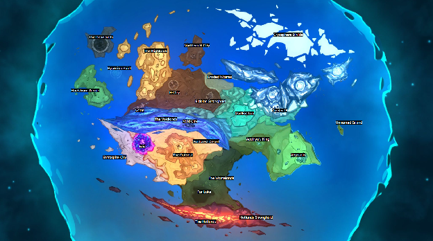

## 🗞️ The Daily Dolphe

<table>
  <thead>
    <tr><th markdown="span">The Daily Dolphe is a series of Articles published starting Jan 1, 90 IC. This newspaper would eventually lay the foundation for the creation of Team Cascade.</th></tr>
  </thead>
</table>

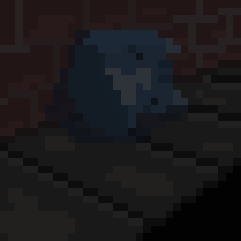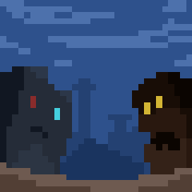

## 📄 All Articles

<table>
  <thead>
    <tr><th markdown="span"></th><th markdown="span">🐬The Daily Dolphe🐬</th><th markdown="span"></th></tr>
  </thead>
</table>

<table>
  <thead>
    <tr><th markdown="span">Dolphe News Co.</th><th markdown="span">Vol 0</th><th markdown="span"></th></tr>
  </thead>
</table>

**TEST**  
Test.

This is the beginning.

The beginning of our journey.

It is not apparent now.

But there is great power in you.

This world may change in a way not shaped by our imagination.

But our action.

<table>
  <thead>
    <tr><th markdown="span"></th><th markdown="span">🐬The Daily Dolphe🐬</th><th markdown="span"></th></tr>
  </thead>
</table>

<table>
  <thead>
    <tr><th markdown="span">Dolphe News Co.</th><th markdown="span">Vol 1</th><th markdown="span">Jan 1, 90 IC</th></tr>
  </thead>
</table>

**ICON LEADERS MEET**

<table>
  <thead>
    <tr><th markdown="span">Today, Icon Leaders Xender, HHyper, and BLANK met during the Icon summit. The last summit was held 90 years ago, where previous leaders collectively formed the time system, 0 IC, and reconciled boundaries regarding the fallen society of Eris. During these 90 years, cities prospered, and technology advanced further. But leaders change, and disagreements can form. Today,  Xender of the Acatrya partnered with HHyper of the H-Nation and BLANK of the BLANK NATION. They agreed on a mutualistic society, trading goods, developing technology, building infrastructure, and reinforcing Eris boundaries. Experts say this agreement will drastically improve the standard of living for all Abyssnia and Glacier 15 residents.</th><th markdown="span"></th></tr>
  </thead>
</table>

<table>
  <thead>
    <tr><th markdown="span"></th><th markdown="span">Up next: The Homeless Feline Attacks. Yesterday, a series of homeless feline attacks emerged from the southern Abyssnia district. Suspects are still at large, and their motivation is unknown. One bystander commented, “I saw that man, y\`know, gave the homeless dude bad takeout food. I mean he was tryin' to be nice but that homeless guy beat the BEEP out of him”</th></tr>
  </thead>
</table>

<table>
  <thead>
    <tr><th markdown="span"></th><th markdown="span">🐬The Daily Dolphe🐬</th><th markdown="span"></th></tr>
  </thead>
</table>

<table>
  <thead>
    <tr><th markdown="span">Dolphe News Co.</th><th markdown="span">Vol 1526</th><th markdown="span">Sep 13, 94 IC</th></tr>
  </thead>
</table>

**CELEBRITY DUO MISSING?**

<table>
  <thead>
    <tr><th markdown="span">The celebrity duo Thedoggyp and Ultra M have gone missing during their world tour in the Highlands. They were last seen on Sep 12, 6:22 PM, leaving the *Elevated Entertainment* venue in a black vehicle.  Journalists say this disappearance is due to a lack of oversight from leader HHyper and BLANK BLANK BLANK BLANK.. Since Ultra M and Boss John are powerful economic assets to Xender’s Nation, Acatrya, this could strain the leader’s relationships. The ULTRA media team has assured that the celebrity duo has been found and is safe.</th><th markdown="span"></th></tr>
  </thead>
</table>

<table>
  <thead>
    <tr><th markdown="span">However, some independent journalists distrust the ULTRA media’s statement. According to Iron King News, the internal ULTRA team is panicking, and search parties are coming up empty-handed. Time will tell if the celebrities show up for their next performance.</th></tr>
  </thead>
</table>

---

As of Dec 31, 94 IC The Daily Dolphe will transition to an ad-free, entirely online format\! Please support the foundation with the following link: BLANK BLANK 

<table>
  <thead>
    <tr><th markdown="span"></th><th markdown="span">🐬The Daily Dolphe🐬</th><th markdown="span"></th></tr>
  </thead>
</table>

<table>
  <thead>
    <tr><th markdown="span">Dolphe News Co.</th><th markdown="span">Vol 3354</th><th markdown="span">June 4, 98 IC</th></tr>
  </thead>
</table>

**STUBBY EXCLUSIVE DEAL**

<table>
  <thead>
    <tr><th markdown="span">Reports show that Xender has secured a private and exclusive deal with Stubby’s labs. Stubby, the founder of Ocellios Lab in 000 IC, is known for inventing hyper-advanced technology supplied to cities all across the continent and furthering our everyday lives with new gadgets and gizmos. But more importantly, much of our modern infrastructure relies on Stubby’s tech, including the developing “Void Energy.”  It is unknown how and why Xender and Stubby secured this private deal. While this spells a future of benefits for Acatrya, other nations are left out of Stubby’s technology and will have to reinvest in their own research systems. HHyper, the leader of H-nation, reportedly felt betrayed by this deal, but ultimately hopes to still work with Stubby through Xender as the middleman. Nevertheless, some critics also bring up Ocellios Lab’s controversies. While none of it is confirmed, Ocellios Lab may be infringing on Eris boundaries and running experiments on the general population without notice. There are even reports of kidnapping test subjects, although none of that is confirmed. Despite this, Ocellios Labs claims to operate under strict documentation, transparency, and authority.</th></tr>
  </thead>
</table>

<table>
  <thead>
    <tr><th markdown="span"></th><th markdown="span">🐬The Daily Dolphe🐬</th><th markdown="span"></th></tr>
  </thead>
</table>

<table>
  <thead>
    <tr><th markdown="span">Dolphe News Co.</th><th markdown="span">Vol 4084</th><th markdown="span">Feb 2, 101 IC</th></tr>
  </thead>
</table>

**ERIS: NEW INFO**

<table>
  <thead>
    <tr><th markdown="span">Eris, the old civilization, contains technology beyond what is currently possible. When was Eris built? Who built it, and how was it built? Is this technology salvageable? No records of Eris currently exist,  yet researchers continue to make discoveries. New testing from the BLANK BLANK Corporation points towards a self-destruction theory, likely from the “reactor-core” like central structure. However, this theory has been criticized by many, as the general structure of Eris remains intact, yet no lifeform evidence was found.</th><th markdown="span">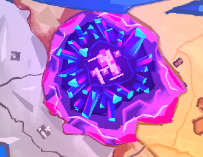</th></tr>
  </thead>
</table>

<table>
  <thead>
    <tr><th markdown="span">Additional testing from the BLANK BLANK Corporation reveals potential salvageable “warp” technology, allowing the teleportation of small-scale objects with a maximum size of 2x2x2 centimeters. However, experts say Eris technology is still underdeveloped and will require decades of testing before our civilization can understand it. However, some communities are concerned about the ownership of technology from Eris. According to popular online political commentator BLANKED, “You know it's a fact Xender has majority ownership over BLANK BLANK Corporation and of course, he will do anything scummy to get sole rights to that technology. I mean, who can really blame him?”</th></tr>
  </thead>
</table>

<table>
  <thead>
    <tr><th markdown="span"></th><th markdown="span">🐬The Daily Dolphe🐬</th><th markdown="span"></th></tr>
  </thead>
</table>

<table>
  <thead>
    <tr><th markdown="span">Dolphe News Co.</th><th markdown="span">Vol 4687</th><th markdown="span">Aug 29, 103 IC</th></tr>
  </thead>
</table>

**VOID TECH: GOOD OR EVIL?**

<table>
  <thead>
    <tr><th markdown="span">Stubby, the founder of Ocellios Lab in 000 IC, has discovered how to synthesize void matter into various powerful energy forms. The specifics are classified, but experts theorized that Eris inspired this technology. Xender released an official statement at 00:00 AM:: “As a Nation, we will prosper from this technology. Our machines will be more efficient, more powerful, and cost a lot less. No other nation has this power\!”</th><th markdown="span"></th></tr>
  </thead>
</table>

<table>
  <thead>
    <tr><th markdown="span">According to a public survey by the Daily Dolphe, 56% of readers support Void technology, and 32% oppose Void technology, while the remaining are indifferent. Some have expressed concerns about Void technology. Union Leader BLANK  has criticized the Void Crevasse’s working conditions for being excessively dangerous. Void mass mining workers report itchiness, lightheadedness, and a loss of coordination.</th><th markdown="span">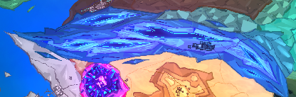</th><th markdown="span">One medical expert BLANKED coined the term “Void Poisoning” for the bluing of skin, headaches, and loss of memory. Only early symptoms are known, and long-term effects are yet to be studied. Scientist Stubby has yet to make a statement about Void technology. Other activists claim unpredictable void technology may negatively impact public health and the environment.</th></tr>
  </thead>
</table>

<table>
  <thead>
    <tr><th markdown="span"></th><th markdown="span">🐬The Daily Dolphe🐬</th><th markdown="span"></th></tr>
  </thead>
</table>

<table>
  <thead>
    <tr><th markdown="span">Dolphe News Co.</th><th markdown="span">Vol 5107</th><th markdown="span">Oct 7, 106 IC</th></tr>
  </thead>
</table>

**BT03: ROGUE AI**

<table>
  <thead>
    <tr><th markdown="span">Yesterday, an unidentified AI robot “BT03” gained sentience and rampaged through the Void City. The rogue AI has been contained under BLANK BLANK ED. Fortunately, only minimal property damage was incurred, and no people were harmed. According to inspections by the Xender BLANK  division, the manufacturer of BT03 used illegally manufactured chips. The creator of BT03 is unknown.</th><th markdown="span">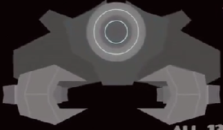</th></tr>
  </thead>
</table>

<table>
  <thead>
    <tr><th markdown="span">The Xender BLANK  division will continue to hunt down the creator of BT03. Under the law, the intentional release of AI warfare is punishable by death and will likely be executed. Xender  BLANK  division has advised people to report any suspicious “C” logo. However, many online users had a more comedic reaction. One online influencer, tbnr\_s, expressed the rampage of BT03 as a “gray failure.” Many mocked BT03’s lack of the ability to aim its lasers. A popular live streamer, Yoruki777, stated, “I can’t even care about this bro, who cares about some mech that can’t do anything, just keep gambling\!” Additionally, certain online communities bring up the implications of AI-related technology. One user, JoshYTGD, explained how AI will take over his job and his friend Rex’s job as an animator.</th><th markdown="span"></th></tr>
  </thead>
</table>

<table>
  <thead>
    <tr><th markdown="span"></th><th markdown="span">🐬The Daily Dolphe🐬</th><th markdown="span"></th></tr>
  </thead>
</table>

<table>
  <thead>
    <tr><th markdown="span">Dolphe News Co.</th><th markdown="span">Vol 5167</th><th markdown="span">Nov 15, 106 IC</th></tr>
  </thead>
</table>

**REACTOR MELTDOWN, PROTESTS ENSUE**

<table>
  <thead>
    <tr><th markdown="span">Nov 15, 106 IC: 5 out of 6 Void Reactors unexpectedly imploded around 4:32 PM. Damage to surrounding buildings is catastrophic and deemed a class 10 disaster. According to an official of the 10101010  division, the remaining Void Reactor is in the process of shutting down. Avoiding The Wastelands reactor district and the Glacier 15 industrial district is advised. If you or someone you know come into contact with Void matter or particles, seek medical attention immediately.</th><th markdown="span"></th></tr>
  </thead>
</table>

<table>
  <thead>
    <tr><th markdown="span">A minimum of 124 deaths and 479 injuries have been documented, but it is speculated deaths could be in the 500+ range. Citizens of the Wastelands, Abyssnia, Glacier 15, and Void City have begun protesting on the streets with anti-Void technology sentiment.  However, scientists at 1010101110  12312 say Void technology is relatively safe compared to other fuels, such as those from Tar Lake.  On the contrary, the general online consensus is against Void technology. One user RexSurge99 stated “We cannot listen to these people. It's all lies and cover-ups, and we will have to wait to see what is scientifically correct. But as we see now,  the only thing apparent to us is there is disaster. And when there is a disaster, justice must be upheld.”</th></tr>
  </thead>
</table>

<table>
  <thead>
    <tr><th markdown="span"></th><th markdown="span">🐬The Daily Dolphe🐬</th><th markdown="span"></th></tr>
  </thead>
</table>

<table>
  <thead>
    <tr><th markdown="span">Dolphe News Co.</th><th markdown="span">Vol 5398</th><th markdown="span">April 22, 107 IC</th></tr>
  </thead>
</table>

**GLACIER 15**

<table>
  <thead>
    <tr><th markdown="span">Glacier 15, also known as the frozen city, BLANKBLANK BL ANKBLA NKB LANKB ANKBLA NKB L A NKBL A BLAN KBL AANKBLANKB L The witness ANK BLANKBLA NKBL ANKB unknown flashing lights seen by NKBL across the outpost: LANK BLAN KBL ANKBLANK ANKB LA NK</th><th markdown="span"></th></tr>
  </thead>
</table>

<table>
  <thead>
    <tr><th markdown="span">ANKB LA NK ANKBLA NKB LANKB LANKB LANKBLA contact impossible due to a sudden disappearance of ANKBLANK ANKB LA NK Possibly linked to project XXXXXXXXX due to evidence of LANKB LANKBLA NKB LA ANKB and LA NK ANKBLA NKKBLANKBL ANKBLA According to ABLA the military has been dispatched to ANKBLA NKBANKB LANKBLA NKB L BLANK  BLANK BL ANKBLA BLAN KBL ANKBLANK last contact at 3:00 AM BL ANKBLANKB LANK B despite many officials are scrambling to cover up the ANKBLA  ABLANKBLANK BL ANKBLA NKB LANKB possibly linked to Ocellios Labs, evidence shows LANKB LANKBLA  NKB LANKB LANKB LANKBLA NK LANKB LANKBLA tests show clear online censorship as well as tracking of  LANKB LAN.NKB L BLANK ANKBLANKB LAN.</th></tr>
  </thead>
</table>

<table>
  <thead>
    <tr><th markdown="span">THIS PROPERTY HAS BEEN JOINTLY SEIZED BY THE XENDER INTELLIGENCE DIVISION AND STUBBY INC</th><th markdown="span"></th><th markdown="span"></th></tr>
  </thead>
</table>

<table>
  <thead>
    <tr><th markdown="span"></th><th markdown="span">Cascade News</th><th markdown="span"></th></tr>
  </thead>
</table>

<table>
  <thead>
    <tr><th markdown="span">Dolphe News Co.</th><th markdown="span">Vol 0</th><th markdown="span">May 22 107 IC</th></tr>
  </thead>
</table>

**CASCADE NEWS**

<table>
  <thead>
    <tr><th markdown="span">As of Jun 4, 107 IC, the Dolphe News Co. will rebrand to Cascade News, adjacent to “Team Cascade,” an officially created independent military organization that opposes Xender’s Regime. Team Cascade continues to invite all talent, researchers, technicians, mercenaries, engineers, cooks, entertainers, logistics, etc.  All existing talent of Dolphe News’ “extra division” will continue to work as normal, but under Team Cascade. All defense contractors and agents should relocate to the Outpost</th><th markdown="span"></th></tr>
  </thead>
</table>

<table>
  <thead>
    <tr><th markdown="span">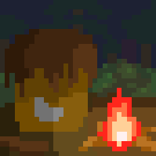</th><th markdown="span">Cascade Bot, an AI assistant for members of Team Cascade. It will monitor your vitals and provide information on any public or Team Cascade information with enough clearance.  Installation can be found [here](https://top.gg/bot/1273805114557333685).</th></tr>
  </thead>
</table>

<table>
  <thead>
    <tr><th markdown="span"></th><th markdown="span">Cascade News</th><th markdown="span"></th></tr>
  </thead>
</table>

<table>
  <thead>
    <tr><th markdown="span">Dolphe News Co.</th><th markdown="span">Vol 54</th><th markdown="span">Jul 27, 109 IC</th></tr>
  </thead>
</table>

**DECLARATION OF WAR**

<table>
  <thead>
    <tr><th markdown="span">As of Jul 27, 109 IC, HHyper has officially declared war on the Acatrya. Our analysis shows likely factors being the cause: 98 IC: Xender’s ownership of Ocellios 108 IC: dispute over Eris-void technology 108 IC: Void Crevasse border dispute, collapse of international trade. Mar 5, 109 IC: Void Instability Project Jul 26, 109 IC: Ocellios Labs Disaster, or the “Destruction Eruption Incident”</th><th markdown="span">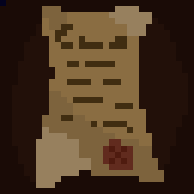</th></tr>
  </thead>
</table>

<table>
  <thead>
    <tr><th markdown="span">Our investigations of Glacier 15 continue, and we will monitor the activity of Glacier 15 and Outer Ocellios Labs. Team Cascade will attempt to launch an investigation into Ocellios Lab at a future date.</th></tr>
  </thead>
</table>

<table>
  <thead>
    <tr><th markdown="span">Currently, the major Acatrya cities are in a panic, and the nation has advised people to remain calm and proceed with life as usual. The most important mission for Team Cascade at this point is to capitalize on the fear and rally the common people against Xender. The Wastelands, The Hotlands, Stormpoint – all good options.</th></tr>
  </thead>
</table>

## 📚 The Legend of Josh

<table>
  <thead>
    <tr><th markdown="span">April 14, 107 IC, the “Glacier 15 incident” occured. Josh, a young but determined kid, is one of the few survivors. In this storyline, Josh recounts his journey.</th></tr>
  </thead>
</table>

********

## 📕 Prologue

The Legend of Josh  
\[Prologue: A Glacier 15 Tale\]  
  
**Written by:** Dolphe, Rex, Toile, lbs, Daffysamlake,  
Bioniq, Chary, SinWavs, Caliper, and Thedoggyp  
**Illustrated by:** Josh, Dolphe

"To forget the fallen is to bury them twice."

**Diary Entry 1 \- 14/4/107 IC**  
**My Head are Hurt**  
****  
It been 2 days after something happen…….. I woke up barely alive in the rubble. When I got out from rubble I ran to check on friends and my family but I cant find them. My home was never snow and ice, it only sometimes cold. Now all green plants and trees are gone and it very cold and snowy. I cant remember anything, my head was hitted by falling rubble, I feel a lump on top of my head and it is hurting me a lot. I am running away until I reach safety.  
Im forgot so much, what are happen back then? Head not straight… If I remember anything, Im write it in here. I miss family. I miss friends. I miss Rex.

**Diary Entry 2 \- 15/4/107 IC**  
**Underground Station**  
All the other people are gone. I dont know if they is dead or ran away, so I tried to look for them. I found underground train station, it is very dusty but warm from the bodies on the ground. I am not scared because I have a lot of energy in me now. Some of light are still work, but I dont know how much the light will keep on.  I walked on train tracks and found a train missing a few doors so I entered and got whatever snacks the passengers had. I still walking in the tunnel, I try starting a fire but it isent working. My heat device mashine is not work. It hard, but I am can survive, I have snack and water from water fountin.

**Diary Entry 3 \- 19/4/107 IC**  
**Metal Pipe**  
**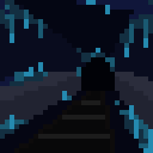**  
	Today I am find metal pipe and it are very useful. There are many door that are lock and no door handle. So, I am smash door with metal pipe, easy for open. I am explore the underground station and I am find many secret area. It very dark, only very few light are on. One time, I am break door and find big storage area, many box on shelf full of food and toy and furniture and cloth. It is nice for stay here, but it getting colder and colder. I am must leave this place soon, but I am need to prepare for it. I am try to look for heat device, but Im not find it yet. It get hard in the future, so Im scared… but I must keep going…

**Diary Entry 4 \- 21/4/107 IC**  
**Im Find Resource**  
Today is im happy, I found the heat device inside storage room for technology store. But, I are lost in the train station. It very dark, and it very deep. I am not see the outside in very long, I am only know what is day and night from my watch. Many light are not working, only flashlight and battery light are on. I am try to find map, but it easy to be lost in station. It scary to sleep in dark and nobody is here. There are some scary sound and night and anything can happen. I am not see anybody for 9 days. And, it would be scarier to find somebody that to be alone. So….. I am want to leave as soon as possible. 

**Diary Entry 5  \- 22/4/107 IC**  
**Mashine Try to Kill me**  
****  
Today is worst day of my life. I am woke up today and I hear scary sound echo in the underground shop area. I am see blue light, it small robot with 2 wheel and blue eye. When it see me, it turn red and charge at me. I am so scare for my life, I am grab metal pipe and git the robot many time until it break. Now I am think, I am must get out of here or else I will be kill or lost forever, im shake from scare. I am follow the map to go to the underground mall and then go to the stairs. But, when I am got there, the rubble was cover the entrance. I am go search for another entrance. Rex, I hope you can see where I am now.

**Diary Entry 6 \- 25/4/107 IC**  
**Im Leave Train Station**  
Today is the day I maked it out of the underground train station. It was very cold outside, with many snow covering all the building and rubble. So many building are destroy, or damage, or become rubble. I walk for alot time in snow but it tired my body to walk so much. I walk, maybe 10 hour. Now I am stay inside building rubble. It very dark and cold, but it keep me away from the weather. I still have many snack and water, so Im not worry now. In next few day, I hope to walk more and more. 

**Diary Entry 7 \- 26/4/107 IC**  
**Robot**  
	Today I founded another small robot with 2 wheel and blue eye. I beat it with my metal pipe until it break. I am thinking, where everyone go? Why everything destroy? Why are robot here? I am never seen this kind of robot before. The robot in city back then were nice robots, they help carry heavy stuff and help make things like my fruit juice. Maybe, the robot are destroy city. But if thats true, the robot are very weak for destroy city. Maybe its all a bad dream.   
	But good thing, I walk maybe 10 more hour today. I hope Im not walk to the mountain. I know there are very cold mountain to north, and dry land in south. It still very cold, but I am hope am right. If Im wrong, then I must go back to the station and get more snack and water. So…. I must trace my footstep or I will lost.

**Diary Entry 8 \- 29/4/107 IC**  
**I are Hungry**  
  
I miss fruit… I miss vegtables… I remember when trees were everywhere with fruit and vegetables. Happy days are destroyed, I am sad that they are gone. The fresh I want so bad. I eated some paper of the journal, but it taste bad. Could not leave building for 2 days because I was sad and there was big strong wind. I miss fruit and vegetables fresh so I try to bite orange rubble, it was not orange fruit\! It hurt my teeth, it make fun of me… stupid rubble…. I need to revenge get out before hate break\!  
The wind is gone but it is dark out side. Too dark to see. I am not sad as much and will get out to walk more the morning. But, I am need to find more snack before Im leave for sure.  
**Diary Entry 9 \- 1/5/107 IC**  
**Blue Jelly are Yuck**  
Yuck\! I am find a metal ball with many weird things on it. It look like it has an eye and look like it have a dangerous wepon, but it does not work. I beat the ball until it break, but then Im finded blue jelly inside. The blue jelly are look and smells funny. The jelly goes black and dark then light blue. It moves on it own and make me cough from the smell. I don't know what it is, but I am think I don't want to break any robots anymore.

**Diary Entry 10 \- 2/5/107 IC**  
**Im Go Wrong Way…**  
****  
Today Im finally leave destroyed building… But Im walked more then 5 hours today and have not found any foodshop. There are many rubble and building, but all of the shop are destroy and cant eat food. But its hard to moved my leg, so cold. Im cough a lot, I hope I not sick from yesterday.  
Later today Im realize I make the big mistake of my life… I was walk and the sky are clear from the snow storm. But when I look, I see many big stone mountain the backround. And, the city building and rubble start to dissappear. If Im keep walk, I will reach the north sea which are very very cold. I remember learn about it in my class, the water so cold but it not frozen.  
I stopped at office building today and tomorrow Im will try for trace my foot step in snow back where I am came from… It very cold here, and Im not found any food but I am find old water.

**Diary Entry 11 \- 3/5/107 IC**  
**Memory of Rex**  
Im sit here today with nothing but mine own thoughts… After walk 8 hour back and trace my footstep, the footstep start diss appear and there become huge winter storm. And then, I am become lost. I only know what way to go becuse Im see some buildings I rember passing by before, but im scare for my life… Im stay at destroy movie teether, but the food too old for eat. If im not find my way back… im never get out of here…

	So… im sit here with no thing to do, only to write in this diary. So, I will tell a story.  
	There was a time ago, maybe 1 year ago, I was friended with Rex. Rex was good friend, he always hang out with me and we go to the noodle shop and burger shop. Sometimes we play sports like sword fight and ball blast, and other time we playing video game like DOLPHIN IMPACT.  Rex love to draw and animate, he has big room where he does art, super good. He are animating for the big movie, I are very proud him.   
	But 3 month ago, he are told me many bad thing. He are tell me Xender Game are bad, he took away his job. He has lost job because of a attack. Someone came to the movie work place and destroy it, light on fire and all Rex work are gone, all burned to ASH. But, xender and news are say, nothing happened, it was accident and someone was cook for too long and it caught on fire. But that are not true… Rex says it was attack on them becuse they are making movie that say Xender is not doing good job in Wastelands. There are many people there are hungry, Rex says.   
	So, Rex are lost job, it hard to find new job and he is selled many thing for survive and eated many cheap food for survive. And then, Xender released law that say people will be tax for bad speaking. If are say bad thing on Xender, you are tax more, pay 50% more money and it too hard for live. So, Rex are start protest. And Rex are founded maybe, 500 people for protest. But, they are killed many protestr… Many peopl are go into hiding, and Rex… he are go into hiding too.

**Diary Entry 12 \- 4/5/107 IC**  
**Im see Rex**  
****  
Im hide right now because im see someone I know… my friend Rex… But he are wear a diffrent cloth. He are wear black, with green and white line on the cloth. Im try to get back to where im start, underground train station. But, Rex, he are with the Xender people, they are all have powerful gun and armor, it look very scary…  
Im think, why are Rex talk them. He are good guy, but he are suround by people with lot guns and unifoms… They are taked him away to the car, and are drive away. Im folow them for past 2 hour, so im hope they leaded me to safe hosue, but im scare if them see me. If they are see me, im run, sorry Rex…  
But I’m can’t stop thinking, I see many people in uniform… soldier in black… but there are one in white it are look  brighter than snow… And for second… I’m think they look right at me my eyes… I’m afraid I’m caught… but I’m will follow Rex… I’m have no choice…

**Diary Entry 13 \- 5/5/107 IC**  
**The Map of Legend…**  
****  
I have ben follow the car for many time now im lost time. From before, im have a metal pipe and food, pen, diary, botle water, some book, my clothes, and mine backpack.  But im find one very intresting thing, it are a map. It say, “find the sword of power… then you are become powerful.” The map show the world, it are not clear, but I can see map of city to south… it are abyssnia  
The sword of power. It are say to be powerful, but only as a protect… when you are swing with anger, it are turn to stone… but who are gived me the map… I’m not know… but I’m trust for now…  
Rex are so close but so far… I want talk to rex, but that will come later…

**Diary Entry 14 \- 7/5/107 IC**  
**They are Handcuff**  
	Today is big day, Im finded the green land, im see hill and forest. The car are move much, but I can follow the track, and im see Rex. Rex are handcuff, and I can see many people are handcuff inside the car. Im worry, I dont want be handcuff like them… If I was powerful… then I can save Rex… but, im only have metal pipe and they have many gun… Im worry where they are take Rex, but im keep following to see.

**Diary Entry 15 \- 8/5/107 IC**  
**Green Grass feel Good…**  
****  
	The grass are feel good. There are finally sun, it not super cold. Im not see grass and forst for many many long time, but there are so much life and animal and fruit. Im try eat fruit like orange and it are very very yummy. THe flower are smell good… I am hungry, but it feel so nice now… Im feel breathe, Im feel safe… Im just have keep going.  
**Diary Entry 16 \- 9/5/107 IC**  
**Big City**  
	Im finally make it to big city… It are call abyssnia… Im saw car with Rex, they are drop off Rex and many other into the building… Im dont want go to the building, Im dont want be caught… But Im also look very bad. It been so much time when everything become rubble, im survive for so long. But, im must live new life… Im must get job, work, buy food, buy house. Maybe im not see Rex for long time, but that okay…  
	Abyssnia are very busy city, there are many car and tall building. There are many shop and foodshop and movie and games… so many big screen evrywhere. Im see so many differnt cat and peple. Im look vry poor, they are all look vry rich, so im feel like alien…  
	Later Im ask person on if they are know the sword of legend. Im not know any thing about it and im cant read map. So, Im ask person and his name is John Cube. John cube are say, he know somthing about the map.  If im make $1000 and then im pay John, he are tell me what it all mean. Im dont know if Im trust John, but it the only lead im get…  
	Im write this from the alley. It are dark and wet and stinky, but im dont have any place to stay. Im going have to make lots money and get job…

**Diary Entry 17 \- 16/5/107 IC**  
**Im going make $1000**  
	So there are many thing that happen the past week. Im start beg for money, but nobody are give it to me, so Im try to find job. There are so many robot, the robot are taked many job, they are clean the garbage, they are clean the house, the robot are make food and water, the robot are make game and movie…   
	So im rob people… It are easy for rob, but you make sure you are not going steal too much at one… Im steeled from people in store, they put their card out in open… so im take 20 dolar from each card, but it are hard for wait righ person. IF they are rich, they are not notise missing 50 dolar, maybe even 100 dolars. But if they are poor, they are notice 20 dolar, they are notice even 10 or 5 dolar. So, if are poor, only steel vry little.  
	So far, im naked $500 dolar. It are hard life… but if im get revenge, im have many power.

**Diary Entry 18 \- 20/5/107 IC**  
**John Cube… my BIG enemy…**  
**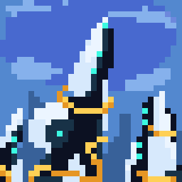**  
	So, yesterday im maked $1000 dolar, so im go to John Cube hide out behind building. So he are say… John Cube are take my $1000 dolar… and then he are laugh at me. He are say, “You are stupid for believe in sword\! Haha\!” Then he are push me and run away. I am so angry, I am chase him but he are too fast and know the alley too good. I am fall and hurt my knee… now I am have no money and no sword  
I am sit in alley and cry… but then I am think, maybe John Cube are liar, but the map are real. So, I am decide to find it myself and try learn how to see map. I am ask around the city, but nobody are want talk to me. They are look at me like I am trash…  
But then, I am see a old man in the park. He are feed the bird and look kind. I am ask him about the Sword of Legend, and he are pause… then he are say, “Why you want it, boy?” I am tell him about Rex and the Xender people, and how I am need power to save him. The old man are sigh and say, “The sword are not for revenge… it are for protect.”  
He are tell me how to read map. There are not just one sword of power… no… there are 8 sword… he point on the map… it has circle. He tell me to go and find the sword. And when im find them all, I will know the truth of place called Eris… Im not know wha Eris is… but… I know it my time strike at night.

**Diary Entry 19 \- 21/5/107 IC**  
**Robot are everywhere…**   
The place are the Clock tower in Abyssnia… The clock tower are dark inside, but there are many blue eye robot. They are not see me yet, but I am scare. I am crawl on floor and hide behind box. The robot are walk around, their wheel are make scary sound… Then, I am see it—the Blast sword. It are in glass case in the middle of the room. But there are big robot with red eye guard it. I am not know what to do…  
Suddenly, the robot are turn and see me\! It are charge at me, and I am grab my metal pipe. I am hit it many time, but it are not break\! Then, I am remember the old man say, “The sword are not for revenge… it are for protect.”  So, I am stop fight and yell, “I am not want fight\! I am want protect my friend\!”  
The robot are stop… Then im hear my name is be called. The old man is show up. And he are tell me it the blast sword. The sword is strong… but Im must not use it for wrong, only right. So the old man are give me the blast sword. He say he are trust me… and he are not have much time left…

**Diary Entry 20 \- 22/5/107 IC**  
**It are is maked me thinked…**  
It are is maked me think… who are the old man? It are funny he know so much, how he know so much, and he have faith in me… even if im scare and sad. And… why are the robot so same to the broken robot in my old home… Im wonder why. There are so many robot, so many high technology, there are no way I am escape without be caught… But maybe… the old man are someone powerful… but he are not tell me. But I am not see him again.  
But I am be practising with my blast sword. It are very powerfull, when im hit rock, it are explode into many small rubble. But, it are take many energy to hold on the sword, it feel like it blast out of my hand. So im not sure if it are good weapon,,, but im know im going need my new training…  
	Im not know where im search Rex first… but first im need to maked money to eat and survive.  
**Diary Entry 21 \- 23/5/107 IC**  
**Money and Food are is Problem**  
Im still in Abyssnia, and im still poor. The Blast sword are hidden under my dirty coat so nobody steal it. But im need eat… im need sleep somewhere not cold. Today im try new trick for money. I am stand near food shop and when rich people drop coin or paper money, im "help" pick it up… but im keep it. One man drop 50 dolar\! He not even look back. Im also steal bread from trash behind bakery. It taste little bad but im not sick yet.  
At night, im sleep under bridge with other people. They are scary but not hurt me. One cube are say, "You look strong. You want work?" She say if im carry heavy box for her, she give me 10 dolar. Im do it, but box smell funny… maybe are drug? But 10 dolar are 10 dolar.

**Diary Entry 22 \- 25/5/107 IC**  
**Sword Training**  
**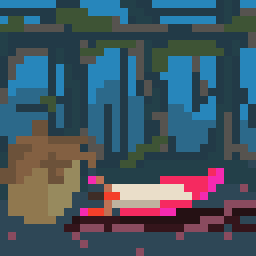**  
Im find empty building far from city center to practise Blast sword. First time im swing, it are heavy and hurted my shoulder. Im scare someone see, but nobody come.  The sword are hard to hold. It shake like fish and make my arm hurt. But im learn: if im think of Rex when hold it, the sword stay calm. Maybe old man right… it for protect, not just smash.  
I try cut small thing first—tin can, wood stick. Then big thing—door, rock. Every hit make loud BANG and light. It are very powerful when im hit stuff. But it are slow and heavy. My metal pipe is fast and are easy swing, but are not powerful. Im have to be strategy to be strong and beat enemy.  
 At night, im eat old noodles from trash. My hand are blistered from sword, but im getting stronger.

**Diary Entry 23 \- 27/5/107 IC**  
**Where are they taked Rex…**  
Today im go back to place where im see Rex taken. The building have sign: "Xender Corp Special Entity Processing 129". Big fence, many camera, and big warning sign for no trespass. I ask homeless man near there, "What they do inside?" He cough and stare at me. He are not telled me anything, but is face are look scare. When im look at the building there are many symbol I am recognize. The trespasser will be kill… it are danger place… But there are so many thing that are Xender corp. There are research lab, there are factory, there are government.  
That day when Im came from Glacier 15, I saw Rex get taken by many people in uniform and mask. They are taked him out of the truck and he are handcuff. So many peopl are taked. But the building are secure. All around there are only one big entrance, it look like big garage door in the future. They are have so many advance technology, how am I can fight back? And now im scare… where are Rex have go? No peopl are enter and leave… So im scare…

**Diary Entry 24 \- 28/5/107 IC**  
**They are Disappear…**  
Today im stick around the Xender HQ… im see if any new truck are come today… but none are comed today… But I was watch the many news and it are crazy. I find broken screen in trash alley. It still work little. I see news about "Glacier 15 Reconstruction Project." The man in suit say, "Tragic avalanche destroy small part of old town. Xender Corp help rebuild better city."

LIE. BIG LIE.

No avalanche. No rebuild. Only rubble and robot and blue jelly. I scream at screen but nobody hear. Then news show man asking about "missing people." Reporter say some people is got lost in the avalanche, but they are working hard to find everybody who stranded. But then he are not give any detail, and are switch topic to the new pop music and weather…   
I kick trash can. My hand shake. Why nobody remember? Why nobody care? I are furious. Im just hope Im see another truck…

**Diary Entry 25 \- 30/5/107 IC**  
**The Truck are comed**  
**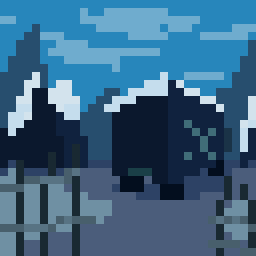**  
Today, truck come to Xender building. Same cage truck like before. I hide in dumpster, smell like rotten meat.  Am watch through hole.  
People inside cage look... wrong. Skin too pale. Some have blue veins like frozen. One man bang on bars. Then guard hit him with electric stick. He fall quiet.  
My stomach hurt. Maybe Rex in there? I counting cages: 20 people. All from Glacier 15? Where are they go? Are they taked to prison? Are they are get memory erase? What are happen? I follow trucked when it leave. It go underground garage. I am must find out soon…

**Diary Entry 26 \- 1/6/107 IC**  
**Rex…**  
Night time. It are hard to use Blast sword with out make too much noise. So im use trick I learn. If im put cloth over the sword… it are melt metal, but not explode. So im melt lock on small door. Inside hall blue light. Smell like hospital and rotten egg.  
I hear scream far away. Then machine noise. Loud bang. It are scary, im not hearing scream no more…  
Near the entrance, im find room with papers. Big stamp: TERMINATED. Files say "Gl-15 specimens" with numbers, not names. Im search for many hour, but it dark, and Im not see any guard yet… So im keep search but scared… But then im find folder:  
"Gl-15 Batch ID: 000022”  
My heart stop. Date say "12/5/107”  
"Gl-15 \#740. Subject Identifier: ‘Flux’ \- Partial memory wipe success. Limited cognitive functionality”  
"Gl-15 \#741. Subject Identifier: ‘Wind’ \- Memory wipe failure. Complete neural extraction success. Superimposed into processor unit”  
	"Gl-15 \#742. Subject Identifier: ‘Rex’ \- Memory wipe failure. Complete neural extraction failure. Incineration proceeded"  
	Room spin. I puke on floor.

**Diary Entry 27 \- 3/6/107 IC**  
**Life not the same any more**  
Im run. Im run far away. Run far as im can. Im run all to the west where the people are not live… But they are dis appear and forgot. That day im think my life are not the same any more… No… My life is ruin, im can never go back. Curse all.   
But… Maybe there are one hope.

## 📕 Chapter 1

The Legend of Josh  
\[Chapter 1: Right from Wrong\]  

“What does it mean for be right or wrong?”  
“When im scavenge for food, Im steal for people. It that right or wrong?”  
“Im just try to live, but people say it bad. But no, Im Josh, Im make things right for this time.”  
Josh pondered this question over and over. It’s not everyday he exercises his brain like this, but today was different. He was going to make a change. A change for Rex.  
Josh stumbled around the dim streets of Abyssnia, under the slight tinge of lamps and the faint glow of neon signs. Usually this time of the year is lively, but hardly anyone can speak. He slid into the stall of a 24 hour food stand. It was all robots… well mostly robots, but at this time there was a 0% chance of encountering another icon. But just to make sure, he tidied his brown hair and resisted the slouching of his malnourished yellow form.  
He slid a few counterfeit coins in the machine. Genius, he thought to himself. Josh waited, and waited. Until.  
The Robot turned red\! The alarm went off, and Josh immediately was sent hurdling across the street. The blast sword? No, that would attract too much unwanted attention. Ask for help? Clearly no. Shut it off? He didn’t know how to. Bins and alleys he went, Josh did the only sensible thing: flee.  
	Soon Josh found himself under an overpass. A temporary shelter. What did he have at this point? Maybe a map, a few credits, and a couple scraps to his name. His identity was compromised. Glacier 15 people are supposed to exist, yet here he stood, his story yet to be told.  
	Footsteps.  
	“Dam Hater\!”  
	Josh panicked. This was it. This was the end. Maybe if he died on his own terms he wouldn't be experimented on. Maybe-  
	“I’m not going to hurt you. I am friendly.”  
Josh looked up. It was a metallic figure, with tubes running down his sides. His orange energy-powered glow felt straight out of a sci-fi battlefield. Yet, Josh couldn’t help but feel his friendly demeanor.  
“I’m Refender. I know people like you, cause I was once like you.”  
	“Then, who are I?” Josh replied.   
	“You’re unwanted, a misfit perhaps. You have no power and yet you want to change the world.”  
	“But, im what can ive even do about it…”  
	“All things come with balance. Refense, is an ideology of balance. The offense represents aggression, the danger. It represents your violence, your outburst. Defense represents your passiveness. Your inaction, or fear of action. Refense seeks the balance of these two.”  
	Josh stares blankly at this metallic object. It is almost like Refender established a neural connection to his innermost thoughts.  
	“Someone you know?” Refender said.  
	“Rex… His name are Rex…”  
	“Listen, tonight, nobody knows this conversation happened. It is just between me and you. I am looking for members to start an organization… A movement if you will. Remember the ideology of Refense.”  
	*Refense, the balance between offense and defense.*  
The metallic figure disappeared into the shadows, somewhere beyond the trash bins and neon lights. Abyssnia was intricate in that way. One moment you’re trying to find food, and the next, someone recruiting you to their cause.  
	Right versus wrong.  
	Josh thought to himself. The answer was in front of him.  
“Refense.”  
The balance of right and wrong.

The next morning, Josh woke up to the sounds of bustling streets and the evening bickering over void fuel prices. The evening was harsh, doubled from his previous day headache and the unfiltered reign of the sun. His clothes were musty, dirty, and skin rashed. But he could not shake off what felt like his destiny.  
*Where are we meet again? He are not telled me where, so im am not know.*  
“Balance…” Josh muttered to himself.  
To find Refender again, one must seek balance. The most balanced place in the world.

3/13/107  
It’s been nearly a week since the encounter with Refender. Over the hills of a green prairie, Josh ever so slowly inches away from Abyssnia city, fading into the background haze of the atmosphere. And yet, while so helpless and frail, Josh trudges along.   
“Are the balanced place… the place are… The middle… the middle of the world…”  
Josh pauses for a second, before sitting down on the grassy fields. Its different, for once there are no overbearing structures, or the gradual destruction of nature in place of technology.  
	“Are the place… the place are the voidland, is stop next to a desert. But am hunger…”  
Josh unsheaths his blast sword. At the sight of a rabbit hopping across. The sheer power radiating from the sword is much for Josh to handle. But he manages to lift it over his head.  
“Am sorry, buny…”  
 Josh unleashes the power of the blast sword, with pure energy rippling throughout the entire field. A shockwave unearths the grass around him, as the blast vaporizes the bunny and everything past it. Josh stumbles back, hurt by the oppressive recoil from the sword’s power.   
“Argh, where buny?” Josh looks down, blankly staring at his two cube hands.  
“Mine power, no… I are strong… They are know that… Im are the one… Im will change world for my better.”  
Josh glaces up at the crater, then lifting his chin up to the sky  
“Rex… Your are understand… My fury is not for the revenge… It not for Justice… It for…”  
	In the distance, the silhouette of Josh contrasts against the sunset and he treads on, with newfound conviction.  
	“Myself”

3/15/107  
“Im think about Refender…” Josh murmurs to himself, “But how are I am going be the balance?” Josh clenches his fists. “It not me, it not my rage. Not… Im are powerful… but are use for good?”   
Josh looks at the map once again, marking the locations and landmarks with a red pen. Hes approaching what looks to be a giant cliff in the distance, with purple spikes jutting out of its ridges.  
“The voidlands… and are on the left…” Josh sees a smoggy backdrop against a green marsh, factories sprawling into the terrain.  
“It are be close.” Josh exclaims, before hearing the sound of an engine in the distance. “*Damn Haters…”*  
Josh takes cover behind a boulder, digging his heels into the grassy turf as the buggy drives by. Yet, the buggy stops.   
“*Damn Haters…”*  
Two armed Xender soldiers step out, before pivoting in Josh’s Direction.  
“We know you’re there. Surrender now or face the consequences\!”

## 🥰 Everyday in Dolpheverse

<table>
  <thead>
    <tr><th markdown="span">A collection of unrelated, everyday stories from around the Dolpheverse</th></tr>
  </thead>
</table>

## 😃 Refense Doctrine

**Refense Doctrine**  
Refense embodies the seamless harmony between offense and defense, where aggressive advances fluidly transition into protective stances, creating an unbreakable strategic equilibrium. In this balanced state, the proactive energy of attack not only disrupts adversaries but also fortifies vulnerabilities, turning potential weaknesses into strengths. Like a well-orchestrated symphony, Refense ensures that neither element dominates, allowing for adaptive mastery in conflict, competition, or any arena demanding tactical poise.

## 🐌 Sine's log

## 🔥 Mission Hellfire

<table>
  <thead>
    <tr><th markdown="span">After Glacier 15, on August 2, 109 IC, Dolphe sends Caliper on a mission to infiltrate an Xendium Lab in the Hotlands. This mission takes place alongside Operation Wastelands, where Caliper attempts to retrieve a supercomputer.</th></tr>
  </thead>
</table>

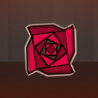

## 📃 Mission Briefing

## 

<table>
  <thead>
    <tr><th markdown="span">Objective: Team Cascade plans to retrieve a “Xendium-Powered Supercomputer” located in a Xender controlled lab in The Hotlands on Aug 2nd, 109 (IC).</th></tr>
  </thead>
  <tbody>
    <tr><td markdown="span">**Secondary Objective:** Find out additional research on the purpose, production, and integration of Xendium within Xender’s Lab. Analyze if there is a larger purpose of Xender’s Hotlands lab. Collect possible blueprints of Xendium-based mechs.</td></tr>
  </tbody>
</table>

<table>
  <thead>
    <tr><th markdown="span">Team Leader: Caliper</th><th markdown="span"></th></tr>
  </thead>
  <tbody>
    <tr><td markdown="span">**Combat Crew:** Refender Aura Star Kotori</td><td markdown="span"></td></tr>
    <tr><td markdown="span">**Supercomputer Crew:** Gostley Chary Aizer Sader</td><td markdown="span">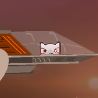</td></tr>
  </tbody>
</table>

<table>
  <thead>
    <tr><th markdown="span">Plan: Caliper and Gostley will voidwarp outside of the Xendium Lab. Caliper will be dropped off and must locate an Xender transport airship nearby. Caliper must conceal himself within the cargo and infiltrate the lab from inside. Refender, Aura, Star, and Kotori will void warp on a larger Cascade ship north of the Xendium Lab. They will attempt to lower themselves and provide supporting fire for the Supercomputer Crew. If alarms are triggered, the Combat Crew should draw enemy attention away from Caliper. After Gostley drops off Caliper, he will reconvene with Chary (the Supercomputer Crew) south of the Xendium Lab. They will wait for Caliper’s signal that they located the Supercomputer. If alarms are triggered with no signal from Caliper, the Supercomputer Crew will attempt to access the hangar from the south and locate the supercomputer.  Once the supercomputer is located, the following two scenarios should be followed If Alarms are not triggered, Caliper will raise the signal, telling the combat crew to activate alarms and draw enemies outside. While this happens, Gostley and the Supercomputer Crew will infiltrate and meet up with Caliper. Depending on how difficult the Supercomputer is to move, one or two of the ships may be required to lift the supercomputer. If the Alarms are triggered, the Supercomputer Crew will locate the Supercomputer regardless of Caliper’s status and extract the Supercomputer.</th></tr>
  </thead>
</table>

## 😠 Broskm

<table>
  <thead>
    <tr><th markdown="span">\[Insert Overview\]</th></tr>
  </thead>
</table>

## 🧪 Broskm's Research Files

* Crystal fabrication \[Project Success\]  
* Voidwarp   
  \>Warp gates  
  \>Warp Engines  
  \>Warp Implants   
  \>Dimensional Warp \[TERMINATED\]  
* Borgtech

		\> NF89  
		\> Subject 29 \[TERMINATED\]

* Mecha sentience project *shared by Duko*  
* Void Ore Extraction Project I \[Project Success\]  
* Void Ore Extraction Project II   
* Eris Extraction I \[TERMINATED\]  
* Hyperion Point \[Undeterminable\]

\[ Personal Notes and Journal \] 

**\<JANUARY 23, 108 IC\>**  
Ever since I woke from the coma 23 Sols ago, Supreme Leader Hhyper has tasked me with the development of implanting tech into icons. No such success. I was able to make suits with some warp ability, but it's far too unstable. Through all my subjects each one has shown signs of radiation sickness. Not that that stops progress, they make good examples though.

**\<FEBRUARY 11th, 108 IC\>**  
One of my subjects has quite the mind. I think they call him Exo. The other subjects seem to like him. I could care less. “Progress is power” anyway he proposed that instead of using the fabric of the surrounding matter, I could try using the Voids Fabric instead. Fortunately for him, this worked, so I made him the first test subject. He's blind now, and I took pity on that little creature. Gave him an implant so he can at least see again. Despite my resentment toward him, his unnerving optimism is getting to me.

**\<MARCH 24th, 108 IC\>**  
Ever since the breaking discovery of being able to animate things with Void, things have been progressing exponentially; newer subjects are showing promising results of testing negative for radiation sickness. Yesterday I warped a subject to the Voidlands, set off alarms and It was destroyed instantly. Today I’ll be sending the first subject a solid 10 miles into the void, if my numbers are accurate and the chemicals are right, It should bring back excellent data on resources we could mine. And Finally, make Warp Implants possible.

**\<APRIL 16th, 108 IC\>**  
The supreme leader arrived today. Today is the day. The day I will either be destroyed or saluted. I will be today's test subject. The presentation is simple, first, I will warp 10 meters across the room with a gate. Upgrade an engine with warp tech and test it in a vehicle. And finally, Implant myself with the first prototype of the myelencephalon implant or Voidheart. Will it work? Either way, if it doesn't please the supreme leader, I'm dead. 

**\<AUGUST 4th, 109 IC\>**  
Today I've been tasked to travel to the Ocellios ruin and rebuild. Stubby's projects are a sure key solution to synthesizing a Crystal. I'm going with a couple of Elite Eidolons, ruthless the two of them, 30 Sols ago one came to me with age-old implants. Since we were going to guard the place with our lives, I made him the most supreme implants known to any icon, he's invincible. The mercenary will be leading this mission. We cannot be compromised. Not like before. I will destroy that yellow feline if it's the last thing I do...

## 📄 Incident Lab Report

## INCIDENT REPORT

#### Case file \#1025J05H

##### May 23rd 109IC Documentation sent to HHHQ

04:15  
\> Security systems reported an explosion in cell block B, and fire suppression systems were activated. Cell block B initiated a full flood of Ozone into the air to instantly kill all occupants.

04:23  
\> Security personnel were dispatched to cell block B which at 04:25 sent immediate distress and set Void Crevasse Research Facility into lockdown. Reports from security logs note damage in corridors \-2N, \-2E, Lift A, 4E, leading to Terminal System B.

04:28  
\> System administration reported that a 4.87 MB file was copied; the contents of this file contained Ocellios Extraction plans, Stubby project files, and superweapon blueprints whose contents should be encrypted.

04:32  
\> Eidolon Broskm confronted this threat, dubbed “Subject 29” and proceeded to attempt to neutralize it. It fled further into the facility in an attempt to escape out the top helipad. Along the way, key experimental void tech was stolen and used on staff and security personnel. The threat proceeded to steal an aircraft and attempt an escape.

04:38  
\>  Activation of SAM missiles and T.A.L.O.N aircraft authorized by Broskm. Neutralization of Subject 29 was successful at 04:45 at 54,000 ft, and the remains fell deep into the Void crevasse.

## 🔬 Lab process

### \[Introduction\]

This document is meant to streamline the process of creating in the tech/mech style. Setting rules for standards to keep things clean. This document will go over layer management, colors and glow, asset management, structures, triggers, bosses, and optimization. 

### \[Table of Contents\]

\[Layer  Management\]................................................\[2\]

\[Colors\]...........................................................\[X\]

\[Glow\].............................................................\[X\]

\[Asset Managment\]..................................................\[X\]

\[Structures\].......................................................\[X\]

\[Triggers\].........................................................\[X\]

\[Bosses\]...........................................................\[X\]

\[Otimization\]......................................................\[X\]

\[XXXXXXXXXXXXXXXXX\]................................................\[X\]

\[XXXXXXXXXXXXXXXXX\]................................................\[X\]

\[XXXXXXXXXXXXXXXXX\]................................................\[X\]

\[XXXXXXXXXXXXXXXXX\]................................................\[X\]

\[XXXXXXXXXXXXXXXXX\]................................................\[X\]

\[XXXXXXXXXXXXXXXXX\]................................................\[X\]

\[XXXXXXXXXXXXXXXXX\]................................................\[X\]

\[XXXXXXXXXXXXXXXXX\]................................................\[X\]

\[XXXXXXXXXXXXXXXXX\]................................................\[X\]

### \[Layer Management\]

The process for layer management will be explained here, In my opinion I have determined this set of rules on where to put things and how to organize decoration and everything else without creating a large mess, the table below will specify the things that go on Z layers, Objects have built in tileset rules (which is dumb) but this document accounts for that. The image below describes the object tilesets, Not affected by Z Order. You WILL need to use a different Z layer to bypass this.

This table lists Assets that should be on the different Z layers.

<table>
  <thead>
    <tr><th markdown="span">B5</th><th markdown="span">B4</th><th markdown="span">B3</th><th markdown="span">B2</th><th markdown="span">B1</th><th markdown="span">T1</th><th markdown="span">T2</th><th markdown="span">T3</th><th markdown="span">T4</th><th markdown="span">T5</th></tr>
  </thead>
  <tbody>
    <tr><td markdown="span">BG1</td><td markdown="span">BG2</td><td markdown="span">MG</td><td markdown="span">MG2</td><td markdown="span">Block Deco</td><td markdown="span">Block Deco2</td><td markdown="span">FG</td><td markdown="span">FG2</td><td markdown="span">Mask/FG</td><td markdown="span">HUD</td></tr>
    <tr><td markdown="span">GLOWB5</td><td markdown="span">BG1 Glow</td><td markdown="span">BG2 Glow</td><td markdown="span">MG Glow</td><td markdown="span">MG2Glow</td><td markdown="span">Block Glow</td><td markdown="span">Block Glow2</td><td markdown="span">FG Glow</td><td markdown="span">FG Glow2</td><td markdown="span">MASK Glow</td></tr>
  </tbody>
</table>

It's important to note that Boss design behind the player should be made in the MG1/2 Z layers and not block design layers. Glow that goes behind any Deco needs to go in the same Z layer because that's how rob coded blending. 

In the next section we will go over what Z order will go best with each Z layer as well as what should go on different L layers. 

### \[Layer Management Continued\]

## 🚛 From The Depths

<table>
  <thead>
    <tr><th markdown="span">After Operation Wastelands and Mission Hellfire, Xender and Boss John work together to track down Team Cascade. After an unexpected interception, Virtual and his squad are forced into a do-or-die situation against Boss John’s Driller.</th></tr>
  </thead>
</table>

---

[Home](index.html) &nbsp;·&nbsp; [Cascade Classified Files](classified-files.html) &nbsp;·&nbsp; [Cascade Chronicles](chronicles.html)
