[Home](index.html) &nbsp;·&nbsp; [Cascade Classified Files](classified-files.html) &nbsp;·&nbsp; [Cascade Chronicles](chronicles.html)

# Cascade Classified Files

A complete encyclopedia of every character, location, faction, technology, and other miscellaneous details.

## Contents

- [🔳 Team Cascade](#team-cascade)
- [🌟 Captains](#captains)
- [🔫 Special Units](#special-units)
- [🗡️ Auxiliary Squad](#auxiliary-squad)
- [🛩️ Aero Squad](#aero-squad)
- [⚔️ Weapons & Vehicles](#weapons--vehicles)
- [❔ Other Units](#other-units)
- [🏨 H-Nation](#h-nation)
- [🩸 H-Eidolons](#h-eidolons)
- [🦾 H-Army](#h-army)
- [⚙️ H-Machines](#h-machines)
- [🐱 Acatrya](#acatrya)
- [🏤 The Administration](#the-administration)
- [🛡️ Defense Division](#defense-division)
- [🤖 Xender Machines](#xender-machines)
- [🔬 Stubby](#stubby)
- [🚩 Side Factions](#side-factions)
- [🌍 World Aligners](#world-aligners)
- [❔ Miscellaneous](#miscellaneous)
- [🗺️ Geographic Locations](#geographic-locations)
- [🧨 Bosses/Enemies](#bossesenemies)
- [❓ Miscellaneous Files](#miscellaneous-files)

---

## 🔳 Team Cascade

<table>
  <thead>
    <tr><th markdown="span">Team Cascade</th><th markdown="span">Last Updated: DATDAD, 109 IC</th></tr>
  </thead>
</table>

Clearance level: 0

<table>
  <thead>
    <tr><th markdown="span">Team Cascade is an independent resistance group that opposes the Xender regime. The organization is broken up into several groups: Captains Special Units Auxillary Squad Aero Squad Other Units</th></tr>
  </thead>
</table>

## 🌟 Captains

<table>
  <thead>
    <tr><th markdown="span">File C-XXX: The PLAYER</th><th markdown="span">Last Updated: DATDAD, 109 IC</th></tr>
  </thead>
</table>

Clearance level: 10

<table>
  <thead>
    <tr><th markdown="span">Joined Team Cascade after Glacier 15 and survived the Destruction Eruption event. Exhibits many unique abilities, particularly with resonance to electricity and void matter.  Displays a unique ability to foresee immediate threats, often dodging and parrying attacks in anticipation. Is extremely skilled in all aspects of combat, spying, hacking, engineering, and many other useful skills for Cascade. The PLAYER is extremely fragile and, in most cases, can only withstand 1-2 attacks before being incapacitated. Is highly unstable in terms of body composition. Has a “cat-like” appearance, though many members of Team Cascade would agree that “The PLAYER” looks and acts a little bit “off.” Could not be located after Operation Voidlands. Further information about this subject and its backstory is unavailable.</th><th markdown="span">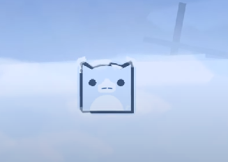 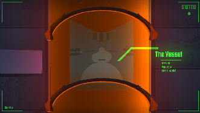 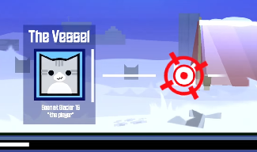</th></tr>
  </thead>
</table>

<table>
  <thead>
    <tr><th markdown="span">File C-000: Dolphe</th><th markdown="span">Last Updated: DATDAD, 109 IC</th></tr>
  </thead>
</table>

Clearance level: 0

<table>
  <thead>
    <tr><th markdown="span">The leader of Team Cascade. Dolphe oversees the logistics of the team, strategic coordination, black-market networking, and maintaining the team's decentralized resistance cells.  Founded Dolphe News Co. in 90 IC, which started as a small local press. Over time, Dolphe expressed frustration with Acatrya’s leadership. After being attacked and censored, Dolphe News began recruiting talent of all types, including mercenaries. Rebranded Dolphe News as Team Cascade in 107 IC after Glacier 15 was destroyed. Displays below-average physical strength and hand-to-hand combat, but excellent skill in wielding energy guns and swords. Specializes in infiltration and deciphering building layouts. Has a special ability to mitigate the effects of void matter. He is equipped with a void resonance bracelet, which injects void particles into his bloodstream. This allows Dolphe to perceive time more slowly, allowing for a “time-stop” ability in tense moments. However, this only works once per bracelet and must be replaced after use.</th><th markdown="span">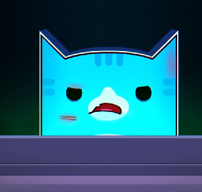 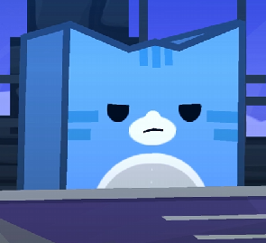 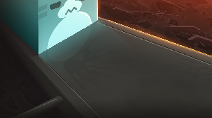</th></tr>
  </thead>
</table>

<table>
  <thead>
    <tr><th markdown="span">File C-000: Dolphe (Cont.)</th></tr>
  </thead>
</table>

<table>
  <thead>
    <tr><th markdown="span">Notably, Dolphe wields an energy sword, SW-Manta. This sword utilizes energy cores with traces of void matter in a tube running along the blade. This sword allows Dolphe to parry by deflecting matter and energy that hits the blade. Dolphe trusts most people at face value, which causes him to let bad actors continue until the damage has already been done. Is particularly close with The PLAYER, Virtual, Nyrvite, Caliper, Andy, Nebula, and Gostley.  *Refer to the Weapons & Vehicles Files for more information.*</th><th markdown="span"> 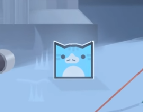</th></tr>
  </thead>
</table>

<table>
  <thead>
    <tr><th markdown="span">File C-001: Virtual</th><th markdown="span">Last Updated: DATDAD, 109 IC</th></tr>
  </thead>
</table>

Clearance level: 0

<table>
  <thead>
    <tr><th markdown="span">Mechanic for Team Cascade. Skilled at hologram engineering, mech engineering, and virtual projection technology. Can create Hologram swords and defensive shields, although weak. Experienced in designing D-class Mechs. Joined Dolphe News in 92 IC and quickly rose to leadership positions through directing large-scale engineering projects. Later, Virtual became the director of all engineering-related activities, focusing efforts on building Cascade’s power and fending off attackers. Displays average physical strength and average skill in wielding energy guns and swords Virtual can appear reserved and closed off towards others, and is close with only a few Cascade members. Thunder is Virtual’s assistant robot. It is equipped with a scouting and data collection mechanism. Can command and communicate via an external terminal attached to Virtual’s wrists. Equipped with 2 mounted 360-degree turrets with area sensors at every angle. Additionally, it offers adequate scouting and survivability.</th><th markdown="span">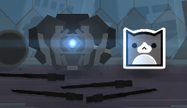 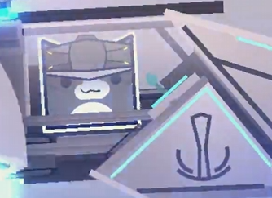 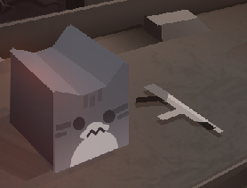</th></tr>
  </thead>
</table>

<table>
  <thead>
    <tr><th markdown="span">File C-002: Caliper</th><th markdown="span">Last Updated: DATDAD, 109 IC</th></tr>
  </thead>
</table>

Clearance level: 0

<table>
  <thead>
    <tr><th markdown="span">Specializes in firearm engineering and design. Caliper was raised in a surprisingly wealthy area near the Void City, sheltered from war and disaster. Despite this, Caliper actively sought to unveil the truth of the world his family hid from him. Even though he was never the direct target, he understood the suffering placed on his friends. He joined Dolphe News in 100 IC personally to spite the Xender system. While raised in a more “proper” household, Caliper actively rebelled against his family. He preferred a more realistic and down-to-earth experience with his friends from neighboring districts. Caliper similarly displays this in his ability to fight and lead missions. His missions have been regarded as wild, insane, and unexpected by other Cascade members. However, his strategy has never failed him, and he has one of the highest success rates.  Some attribute it to his free-spirited personality manifesting itself in tactics.</th><th markdown="span">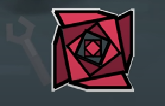 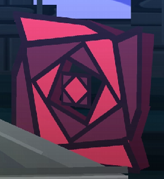 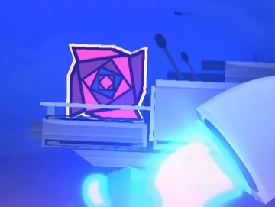</th></tr>
  </thead>
</table>

## 🔫 Special Units

<table>
  <thead>
    <tr><th markdown="span">File SU-000: Nebula</th><th markdown="span">Last Updated: DATDAD, 109 IC</th></tr>
  </thead>
</table>

Clearance level: 0

<table>
  <thead>
    <tr><th markdown="span">Specializes in survival, terrain traversing, and gaining tactical advantages using terrain. Incredibly accurate with a pistol, but struggles to wield higher-caliber weapons.  Displays average skill in piloting aircraft and utilizing mounted turrets. Excellent mountaineer. Survivalist. He trained his extraordinary pistol aim through numerous wildlife encounters. Frequently studies terrain and is extremely involved in planning attacks.  In certain situations, Nebula has the authority to act as a commander. In his free time, Nebula often plays flight simulator games. He is one of the highest-ranked players in “War of Airships,” skills often transferring to combat in Team Cascade Missions.</th><th markdown="span"> 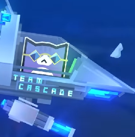 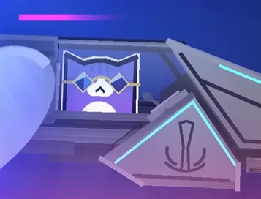</th></tr>
  </thead>
</table>

<table>
  <thead>
    <tr><th markdown="span">File SU-001: Gostley</th><th markdown="span">Last Updated: DATDAD, 109 IC</th></tr>
  </thead>
</table>

Clearance level: 0

<table>
  <thead>
    <tr><th markdown="span">Member of the Special Units Cascade division with an unknown backstory. He exhibits an unknown anomalous behavior, not yet researched.  Wears a contact lens that allows Gostley to make accurate calculations and display them in his vision. Displays above-average skill in wielding mounted turrets and handguns.  After the invasion during Project Novaform, Gostley sustained light injuries from encounters with the H-army and Eidolon Bli. In his free time, Gostley practices animation. However, he often struggles with unsolvable, niche bugs, which ruin the animation.</th><th markdown="span">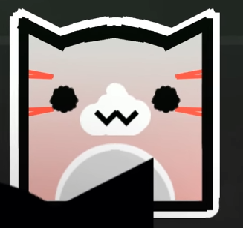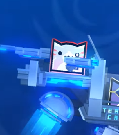 </th></tr>
  </thead>
</table>

<table>
  <thead>
    <tr><th markdown="span">File SU-002: Nyrvite</th><th markdown="span">Last Updated: DATDAD, 109 IC</th></tr>
  </thead>
</table>

Clearance level: 0

<table>
  <thead>
    <tr><th markdown="span">A member of Team Cascade and self-proclaimed “ninja.” She first lived on the outskirts of Abyssnia, dreaming of moving into the big city. However, Nyrvite got entangled in a conspiracy group promising a free city life in exchange for becoming an undercover agent who fights injustice. Joined Dolphe News in 102 IC and helped rebrand into Team Cascade. Her signature weapons are dual-energy machetes. She is also proficient at wielding blasters, but only accurate at close ranges.  Displays excellent swordsmanship and maneuverability. Displays average physical strength. Displays below-average marksmanship. Is only certified to fly Cascade’s helicopter vehicles. These are significantly easier to pilot due to not having Voidwarp capabilities and having omnidirectional energy boosters to automatically regulate position. *Refer to the Weapons & Vehicles Files for more information.*</th><th markdown="span">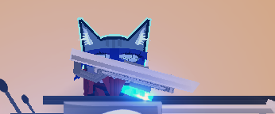 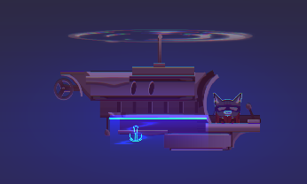</th></tr>
  </thead>
</table>

<table>
  <thead>
    <tr><th markdown="span">File SU-003: Blastix</th><th markdown="span">Last Updated: DATDAD, 109 IC</th></tr>
  </thead>
</table>

Clearance level: 3

<table>
  <thead>
    <tr><th markdown="span">A member of Team Cascade, originating from H-Nation. Blastix’s backstory is relatively unknown, but it has a connection with H-Nation’s “Highlands.” Was later recruited by Acid as part of the Cascade flight program. Exhibits phenomenal hand-to-hand combat abilities and melee weapon capabilities with a laser scythe. However, he is unable to use any sort of firearm accurately. This puts him at a disadvantage in most ranged situations. However, Blastix has the skills to neutralize energy shots by absorbing them into his scythe. However, he is unable to absorb too much energy at once, or else the scythe overloads. When not in combat, sometimes likes to make music.  Was temporarily given higher clearance during the events of Project Novaform to ride in a helicopter-class Cascade vehicle*. Refer to the Weapons & Vehicles Files for more information.*</th><th markdown="span"></th></tr>
  </thead>
</table>

## 🗡️ Auxiliary Squad

<table>
  <thead>
    <tr><th markdown="span">File AU-000: Bee Jee</th><th markdown="span">Last Updated: DATDAD, 109 IC</th></tr>
  </thead>
</table>

Clearance level: 2

<table>
  <thead>
    <tr><th markdown="span">A member of Team Cascade and a former biologist and bioweapons engineer at Ocellios Labs before its destruction. She became disgusted with Stubby's methods when running experiments on Acatrya prisoners, eventually seeking other work. Later, she encounters one of Team Cascade's outposts, offering to supply them with weapons. She mainly assists Team Cascade in creating weapons that would benefit them and their operations. She is also capable of augmenting existing Cascade weaponry, such as their rifles and mounted turrets, making them more effective. While useful, she is not skilled in any advanced combat, with her weapons being her only main form of defense when in danger. She shows some skill when handling these weapons, namely light and medium firearms. She has goggles that can adjust her sight and display different interfaces, such as a velocity sensor, ruler, and an aim assist. A small third lens can magnify her view past the normal capability of the goggles, up to a microscopic level. She may occasionally look into betting on Waste Colosseum fights to fund her and Cascade's projects.</th><th markdown="span"> </th></tr>
  </thead>
</table>

<table>
  <thead>
    <tr><th markdown="span">File AU-001: Lily Lovelace</th><th markdown="span">Last Updated: DATDAD, 109 IC</th></tr>
  </thead>
</table>

Clearance level: 3

<table>
  <thead>
    <tr><th markdown="span">A member of Team Cascade from Abyssnia City. After graduating from culinary school, she started her small canteen, but shortly after, the war between HHyper and Xender broke out. Lily joined Team Cascade to help stop the conflict as her business struggled. Designated as an intel gatherer with the disguise being a traveling chef renting places and switching them every couple of weeks, maybe months. A highly skilled cook, optimistic, has a great memory for faces, and is really happy when she sees clients revisit her places Lily is known for remembering everyone and everything, which helps her in forming bonds with other team cascade members or even random people she meets on the street. It's really hard to make her dislike you. While not designated for combat roles, Lily has sufficient training in combat, being able to get out of compromising intel missions. Notably, her pan can deflect energy blasts.</th><th markdown="span">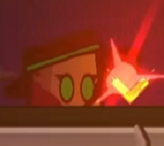 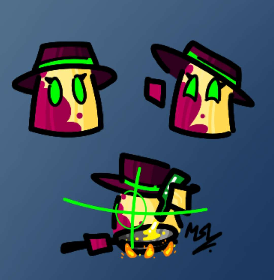</th></tr>
  </thead>
</table>

<table>
  <thead>
    <tr><th markdown="span">File AU-002: Caandy</th><th markdown="span">Last Updated: DATDAD, 109 IC</th></tr>
  </thead>
</table>

Clearance level: 0

<table>
  <thead>
    <tr><th markdown="span">A member of Team Cascade originating from a city adjacent to Void City. He grew up with an interest in void technology, but never got the opportunity in the education system. The people rejected him. Joined Team Cascade partially to fulfill his dreams of working with high-tech facilities and express his frustrations with the Xender government. He has an enhanced ability to detect hidden traps through his AI-assisted visor. Often part of scouting missions, clearing the way before the main forces arrive. Knows how to disarm traps and set them up.  Displays below-average physical strength. Displays a high level of problem-solving skills. Does not have much experience with heavy combat, but can hold his ground in hand-to-hand combat.</th><th markdown="span">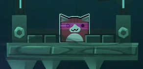</th></tr>
  </thead>
</table>

<table>
  <thead>
    <tr><th markdown="span">File AU-003: Polo (Gaipolo)</th><th markdown="span">Last Updated: DATDAD, 109 IC</th></tr>
  </thead>
</table>

Clearance level: 0

<table>
  <thead>
    <tr><th markdown="span">A member of Team Cascade, identifying as a polar bear. Polo, also known as Gaipolo, has no unique specialties. Originating from the Wastelands, Polo worked in the mines and aspired to be a Wastelands Colosseum superstar. She studied how to wrangle mechanical scrap together to create unstable and dangerous devices. After entering the Wastelands Colosseum, Polo lost in the second round. Disheveled, Polo swore to take revenge until she met Josh from Team Cascade in 108 IC. Josh helped Polo realize the hopelessness of living in the Wastelands and pushed her to become a freedom fighter and join Team Cascade. While lacking in combat abilities, Polo often raises morale by waving a flag around and using her contraptions to confuse the enemies. People always get a laugh out of Polo, even if sometimes she causes unnecessary chaos. Polo has a strange fixation on artificial status within the Team Cascade experience ranking. While the experience ranking system was intended to gamify taking commissions and being productive, Polo has exploited it to boost her artificial experience ranking. These rankings serve no purpose except for cosmetics and to give members a sense of progression.</th><th markdown="span">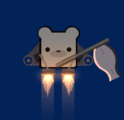 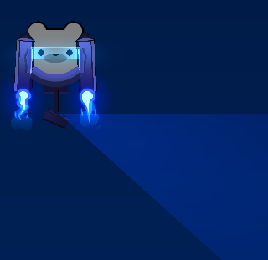</th></tr>
  </thead>
</table>

<table>
  <thead>
    <tr><th markdown="span">File AU-004: Arkiver</th><th markdown="span">Last Updated: DATDAD, 109 IC</th></tr>
  </thead>
</table>

Clearance level: 0

<table>
  <thead>
    <tr><th markdown="span">Is skilled at using melee weapons and specializes in dual-wielding elemental-infused gauntlets. Has moderate experience in engineering and designing melee weapons, including elemental-infused circuitry. However, due to circumstances out of his hands, he is frequently assigned non-combatant roles, often managing resources and supplies and sending out mission intel.</th><th markdown="span">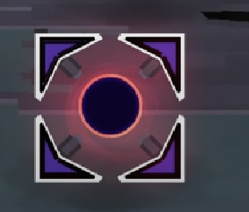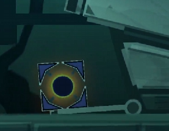</th></tr>
  </thead>
</table>

<table>
  <thead>
    <tr><th markdown="span">File AU-005: Slikrz</th><th markdown="span">Last Updated: DATDAD, 109 IC</th></tr>
  </thead>
</table>

Clearance level: 0

<table>
  <thead>
    <tr><th markdown="span">A lobotomized cube that appeared in The Wastelands in 100 IC seemingly out of nowhere. He claims he was not always like this, that in a previous time he was “less enlightened.” He claims he worked a simple construction job, but his employer required a “surprise surgery” to continue working. Post-operation, he joined Team Cascade in 108 IC. He outrageously claims to have the ability to see into different dimensions. He often attempts to control the opponent's mind, either loudly shouting incantations or being completely silent with a stoic face.  Usually relies on the plasma pistol that he expertly wields. Confusingly, he had not been able to use the rifle skillfully until after the surgery. Research shows that he was implanted with a special device that releases substances into his bloodstream. The purpose of this is unknown.</th><th markdown="span">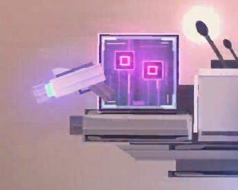</th></tr>
  </thead>
</table>

<table>
  <thead>
    <tr><th markdown="span">File AU-006: IH</th><th markdown="span">Last Updated: DATDAD, 109 IC</th></tr>
  </thead>
</table>

Clearance level: 0

<table>
  <thead>
    <tr><th markdown="span">IH specializes in creating and using handheld Railguns, electromagnetic pistols, and EMP grenades. IH dislikes the declining conditions of Xender's administration, especially the increased cost of goods and treatment of the Wastelands workers. After reading the truth of Xender’s void-experimentation in the Daily Dolphe, IH joined Team Cascade. Displays average physical strength and average skill in wielding weapons.</th><th markdown="span">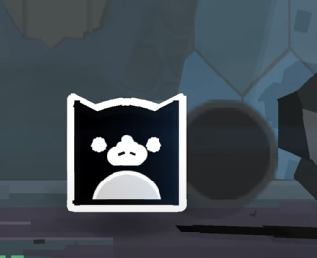</th></tr>
  </thead>
</table>

<table>
  <thead>
    <tr><th markdown="span">File AU-007: Nexus</th><th markdown="span">Last Updated: DATDAD, 109 IC</th></tr>
  </thead>
</table>

Clearance level: 0

<table>
  <thead>
    <tr><th markdown="span">Nexus is a low-ranking Cascade member who is proficient in operating rifles. He aspires to rise through the ranks of Cascade, but has yet to prove his usefulness in battle. He oftentimes stands in the back lines firing from afar.  While the Cascade leveling system exists to give members a sense of progression, he, too, exploits it like Polo. Nexus optimizes progression through mass accepting commissions, then doing ordinary activities to passively gain experience level.</th><th markdown="span">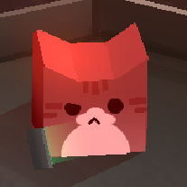 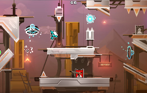</th></tr>
  </thead>
</table>

<table>
  <thead>
    <tr><th markdown="span">File AU-008: Axel</th><th markdown="span">Last Updated: DATDAD, 109 IC</th></tr>
  </thead>
</table>

Clearance level: 1

<table>
  <thead>
    <tr><th markdown="span">Underwent experimentation from Stubby’s Labs after being unjustly convicted of treason. He was forced to replace organs with void-powered augments, which corrupted his body over time. Managed to escape Ocellios' Lab during the first Ocellios siege in 108 IC.  Now out for revenge, Axel joined Team Cascade. Axel frequently malfunctions and is often dazed, but can be powerful at times. Displays excellent physical strength, but cannot wield complex weapons without malfunctioning.  During the events of Project Novaform, Axel was sliced in half by an H-army minion. Axel’s augments and body were beyond repair, and he was pronounced dead 2 hours after the raid on the outpost.</th><th markdown="span">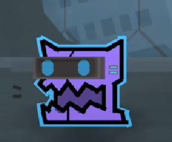 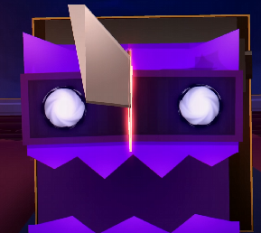</th></tr>
  </thead>
</table>

<table>
  <thead>
    <tr><th markdown="span">File AU-009: Daffy & Lake</th><th markdown="span">Last Updated: DATDAD, 109 IC</th></tr>
  </thead>
</table>

Clearance level: 0

<table>
  <thead>
    <tr><th markdown="span">Daffy and Lake are two siblings who joined Team Cascade after their parents were killed in Xender’s Void Instability project. The event was covered up, and Daffy and Lake were silenced from ever speaking.  They exhibit average physical strength with no special abilities. During the Ocellios Mission, Daffy and Lake hijacked a train heading towards the Eidolon Stronghold. They grabbed experimental weapons from Stubby’s Lab while Dolphe infiltrated and drew the attention of major defense systems. This superweapon was a key component in defeating the Eidolons in the Mission. However, a missile struck the train directly, causing their death.</th><th markdown="span">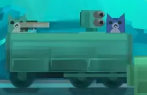 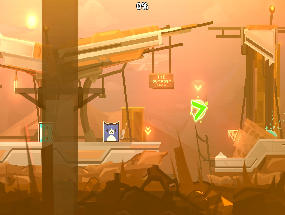</th></tr>
  </thead>
</table>

## 🛩️ Aero Squad

<table>
  <thead>
    <tr><th markdown="span">File AS-000: Andy</th><th markdown="span">Last Updated: DATDAD, 109 IC</th></tr>
  </thead>
</table>

Clearance level: 0

<table>
  <thead>
    <tr><th markdown="span">An engineer and an Air Force Commander for Team Cascade, specialized in airship piloting and airship weaponry design. Knowledgeable in void technology and have experience designing elementary Voidwarp abilities. Joined Dolphe News Co in 102 IC. Displays average physical strength and below-average skill in wielding energy guns and swords.  Displays excellent skill in engineering weapons and piloting vehicles with mounted turrets. Was missing after Ocellios, but during the Voidlands search party, Andy was found crashed in rubble, sustaining light injuries. During the events of Project Novaform, Andy started piloting higher-tier aircraft. During the emergency, Andy was given higher clearance.</th><th markdown="span">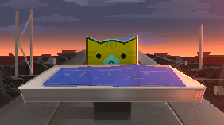 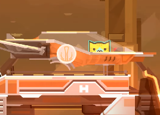 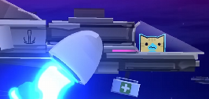</th></tr>
  </thead>
</table>

<table>
  <thead>
    <tr><th markdown="span">File AS-001 Sader Vorae</th><th markdown="span">Last Updated: DATDAD, 109 IC</th></tr>
  </thead>
</table>

Clearance level: 0

<table>
  <thead>
    <tr><th markdown="span">Sader was a resident of Glacier 15, specifically in the Estonia district. Her entire life was destroyed in the Glacier 15 incident. After barely surviving the cold, Sader scoured the streets of Abyssnia to find out what happened in Glacier 15\. Later, she met Josh, a recruiter for Team Cascade. Having been a survivor of Glacier 15, Josh sympathized with Sader and offered a role in Team Cascade, specifically for scouting. Initially, she would fly over Glacier 15, collecting data about the region. However, as other matters became more urgent, Sader was relegated to general aircraft operations. Does not possess any physical combat abilities, but is experienced in flying aircraft. Sader also poses a unique “feel” of void matter. She would call it the “sea of void.”</th><th markdown="span">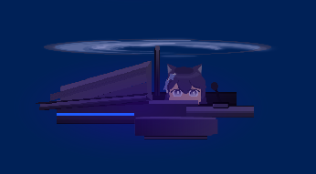 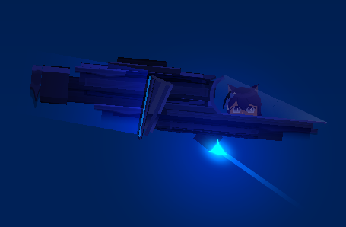</th></tr>
  </thead>
</table>

<table>
  <thead>
    <tr><th markdown="span">File AS-003: Evz</th><th markdown="span">Last Updated: DATDAD, 109 IC</th></tr>
  </thead>
</table>

Clearance level: 0

<table>
  <thead>
    <tr><th markdown="span">A member of Team Cascade, originating from Stormpoint City. He studied to become a doctor and enjoys helping people. However, his job as a doctor started to become more irrelevant as weapons became more dangerous, oftentimes instantly killing anyone without a chance of survival. Evz later pivoted his studies to mechanical repairs and airship piloting, while retaining his knowledge as a Doctor. Due to his wide skillset, Evz was approached by Cascade recruiters. Does not exhibit unique combat abilities and is only certified to fly Cascade’s helicopter vehicles. *Refer to the Weapons & Vehicles Files for more information.*</th><th markdown="span">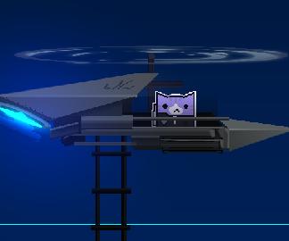</th></tr>
  </thead>
</table>

<table>
  <thead>
    <tr><th markdown="span">File AS-004: Vegetable Tam</th><th markdown="span">Last Updated: DATDAD, 109 IC</th></tr>
  </thead>
</table>

Clearance level: 2

<table>
  <thead>
    <tr><th markdown="span">A member of Team Cascade, also nicknamed “Vegtam.” Originally part of Xender’s air force, but disappeared from action to pursue his lifelong dream of growing carrots. Originally lived in Abyssnia with a decent life, but found his true calling in working the land. Later, moved to the rural valley west of Abyssnia. He lived off the grid but struggled to sustain himself without a steady income. Later, he was approached by Cascade Recruiter Acid, who offered him a part-time job to fly planes for Team Cascade while working in its agriculture sector. While skilled, Vegtam does not hold a significant stake in the revolution. He often performs his job when necessary and grows carrots in his free time.</th><th markdown="span">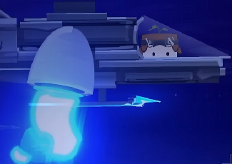</th></tr>
  </thead>
</table>

<table>
  <thead>
    <tr><th markdown="span">File AS-005: FAX</th><th markdown="span">Last Updated: DATDAD, 109 IC</th></tr>
  </thead>
</table>

Clearance level: 0

<table>
  <thead>
    <tr><th markdown="span">A member of Team Cascade, originating from Void City. He always had great aspirations: he wanted to be the leader of an international company, to be the strongest fighter, to be the most skilled flyer, to be the most legendary artist, and to become the most respected scientist. Yet, FAX fell flat on all of these goals. Frustrated with the system, he ran away from Void City to Stormpoint City, where he would survive off odd jobs, barely scraping by. FAX slowly realized his true desires would never be fulfilled, not with the current Xender regime. He scouted for this mysterious “Team Cascade” until he was approached by Josh in 108 IC. Josh reluctantly recruited FAX and specifically assigned him to map terrain. FAX was frustrated at this designation and knew he was capable of more. During the events of Project Novaform, FAX was temporarily given clearance to ride in a remotely controlled airship. *Refer to the Weapons & Vehicles Files for more information.*</th><th markdown="span">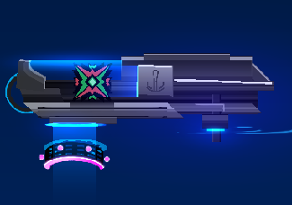</th></tr>
  </thead>
</table>

## ⚔️ Weapons & Vehicles

<table>
  <thead>
    <tr><th markdown="span">File WV-000: Standard Cascade Ship</th><th markdown="span">Last Updated: DATDAD, 109 IC</th></tr>
  </thead>
</table>

Clearance level: 0

<table>
  <thead>
    <tr><th markdown="span">The standard issue Cascade Ship. This is the only airship Team Cascade has many units of. It is relatively durable and features a single seat for the pilot and two positions for gunmen on top.  This model is capable of Voidwarp only on certain ships, specifically with a Voidwarp module attached. These Voidwarp engines are very weak, only being able to traverse short distances, and require weeks to recharge.  Piloting this vehicle requires a special certification due to a lack of automatic features. Landing, takeoff, and Voidwarp are manual, which requires special training. It can be particularly difficult because the thrusters must be manually adjusted in their rotation axis.  Cascade Ship Model A does not come with any built-in defense systems, while its modular design does allow it; its primary purpose is transporting gunmen on top. All ships of this kind have eject buttons. The ship is only meant to handle low altitudes due to its primary purpose.</th><th markdown="span">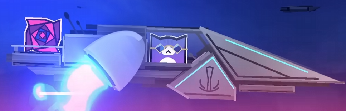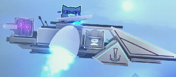 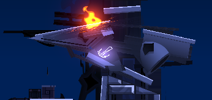</th></tr>
  </thead>
</table>

<table>
  <thead>
    <tr><th markdown="span">File WV-001: SW-Manta</th><th markdown="span">Last Updated: DATDAD, 109 IC</th></tr>
  </thead>
</table>

Clearance level: 1

<table>
  <thead>
    <tr><th markdown="span">SW-Manta is an energy sword that utilizes energy cores with traces of void matter in a tube running along the blade. This allows the blade to be “anti-void.” This mechanism works because if outside void force comes into contact with the blade, the void within the blade will react, creating an opposite force on the outside void matter. Note that the sword must have velocity for it to work. A sitting sword will not be anti-void, as the void will remain inert. SW-Manta is exclusively built by Team Cascade and is fairly rare. There are only 4 swords in the facility, one being wielded by Dolphe, and one by The PLAYER. Manufacturing the SW-Manta is a difficult process, primarily getting trace amounts of void into containers. When dealing with void matter at a microscopic level, conventional methods of manipulating microscopic matter break down when applied to void matter. Primitive methods sought to completely avoid this problem by combining void matter into alloys used for swords.</th><th markdown="span">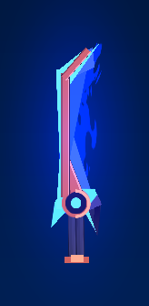</th></tr>
  </thead>
</table>

<table>
  <thead>
    <tr><th markdown="span">File WV-002: Spear of Severance</th><th markdown="span">Last Updated: DATDAD, 109 IC</th></tr>
  </thead>
</table>

Clearance level: 5

<table>
  <thead>
    <tr><th markdown="span">Spear of Severance is a secret one-time-use weapon manufactured by Team Cascade. The blueprints to construct it were unveiled during the Glacier 15 investigation. The premise is fairly simple: a deceivingly simple spear, but never used for actual close-quarter combat. Instead, the tip of the spear is entirely filled with volatile void matter. Upon contact with velocity in a certain direction, the void is ignited by a unique chemical compound in a separate chamber in the spearhead. This compound is formed by first distilling the tar from Tar Lake. Then, react that compound with hexafrozide under high heat until it turns into a blue paste. Due to the void matter’s unique response to velocity, the Spear of Severance is an extremely effective tool of mass destruction. When detonating, the reaction will emit a high-energy beam, reacting all the void matter into pure energy that vaporizes an entire cylindrical cone around 0.5km from the contact point. Used as an experimental last resort in the Project Novaform incident, when Dolphe was struggling to fight Bli.</th><th markdown="span">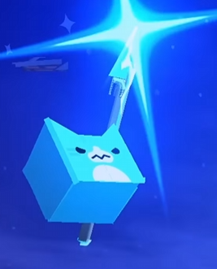 </th></tr>
  </thead>
</table>

<table>
  <thead>
    <tr><th markdown="span">File WV-003: Sol Magnum</th><th markdown="span">Last Updated: DATDAD, 109 IC</th></tr>
  </thead>
</table>

Clearance level: 2

<table>
  <thead>
    <tr><th markdown="span">Sol Magnum is a special weapon designed by Team Cascade specifically to counter extremely durable and void-resistant metals. Only effective short-range. The device works by loading an entire block of a special alloy into the rear chamber. The weapon can fire three times before needing to be reloaded. Sol Magnum requires the alloy to be superheated inside the chamber, which requires at least 10 seconds of prep. Once heated, the temperature of the alloy is safely maintained in the chamber for up to an hour. Pressing the trigger will activate energy cells in the front to draw approximately one-third of the alloy block’s volume into the front chamber, which is then rapidly compressed and accelerated out of the muzzle. Currently, there exist only two units of the Sol Magnum. Its use is extremely niche and expensive, making it impractical for most missions. The special alloy is created by superheating a microscopic amount of permafrost ore until it disassembles.</th><th markdown="span">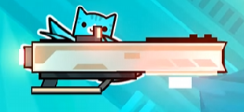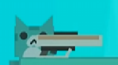</th></tr>
  </thead>
</table>

<table>
  <thead>
    <tr><th markdown="span">File WV-004: The Sunfish</th><th markdown="span">Last Updated: DATDAD, 109 IC</th></tr>
  </thead>
</table>

Clearance level: 1

<table>
  <thead>
    <tr><th markdown="span">The Sunfish is an uncommon basic Cascade ship model whose purpose is to Voidwarp more often than other ships. To maximize the efficiency of the design, most of the budget is put towards the Voidwarp engine in the rear. It is also highly recommended not to ride on top of Sunfish Cascade models. Like Cascade Ship Model A, the Sunfish requires a special license to operate. Unlike the Cascade Ship Model A, it is mainly for the delivery of weapons or supplies. It is uncommon to attach guns to Sunfish models, although possible. The Sunfish features only one seat in the cabin. It is capable of flying at high altitudes.</th><th markdown="span">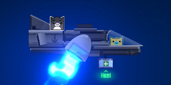</th></tr>
  </thead>
</table>

<table>
  <thead>
    <tr><th markdown="span">File WV-005: The Crawfish</th><th markdown="span">Last Updated: DATDAD, 109 IC</th></tr>
  </thead>
</table>

Clearance level: 1

<table>
  <thead>
    <tr><th markdown="span">The Crawfish is an extremely rare cascade ship model designed for maneuverability and Voidwarp. Unlike other models, this ship can carry two passengers inside. The Crawfish model used to be popular from 105-107 IC. However, this model was phased out due to their more fragile design. The surviving Crawfish models only exist because they survived the test of time, Voidwarp after Voidwarp. This model was also phased out because it did not serve any special purpose to warrant the cost of manufacturing. Other ship models served more specific purposes better, while The Crawfish was only “okay” at multiple things.  Can fly at low-mid altitudes. Requires a special license.</th><th markdown="span"></th></tr>
  </thead>
</table>

<table>
  <thead>
    <tr><th markdown="span">File WV-006: Cascade Scouter</th><th markdown="span">Last Updated: DATDAD, 109 IC</th></tr>
  </thead>
</table>

Clearance level: 1

<table>
  <thead>
    <tr><th markdown="span">The Cascade Scouter is a semi-rare Cascade ship model exclusively built for combat and scouting. These models have weak thrusters built to hover close to the ground. The model features a mounted machine gun in the rear, with a laser canon attached under the cabin. Interestingly, both the pilot and the outside gunner have control over the guns. This model is incapable of Voidwarp. It is also more fragile than other ship models. Requires a special license, although slightly less strict than for other standard models.</th><th markdown="span"></th></tr>
  </thead>
</table>

<table>
  <thead>
    <tr><th markdown="span">File WV-007: Cascade Helicopter</th><th markdown="span">Last Updated: DATDAD, 109 IC</th></tr>
  </thead>
</table>

Clearance level: 0

<table>
  <thead>
    <tr><th markdown="span">The Standard issue Cascade Helicopters. They are fairly common vehicles, although less common than the Standard Cascade ship. They come in some variations, although all serve the same purpose. The images on the right correspond to Model A (top), Model B (top-middle), Model C (bottom-middle), and Model D (bottom). The Cascade Helicopter models feature some automated systems, making the ship require less strict licenses to fly. Its primary purpose is to drop supplies or bombs. It is uncommon to see mounted turrets on Cascade Helicopters, although it is possible. Some variants will include additional ion thrusters, which help with automated movement. The drawback of these models is that they cannot accelerate in one direction quickly.  Can fly at low-mid altitudes.</th><th markdown="span">  </th></tr>
  </thead>
</table>

<table>
  <thead>
    <tr><th markdown="span">File WV-008: Cascade Carrier Ship</th><th markdown="span">Last Updated: DATDAD, 109 IC</th></tr>
  </thead>
</table>

Clearance level: 0

<table>
  <thead>
    <tr><th markdown="span">The Cascade Carrier Ship is an uncommon Cascade ship model specialized in carrying many passengers. These models are not capable of Voidwarp, although similar-looking models exist that have Voidwarp (they are not classified the same, however, and operate under very different mechanics). These ships contain numerous weapons, ammo, and first aid supplies. These ships are highly durable and built to withstand heavy gunfire, missiles, lasers, and even a few shots from void weapons.  Can fly at low and mid altitudes. Requires a special license.</th><th markdown="span"></th></tr>
  </thead>
</table>

<table>
  <thead>
    <tr><th markdown="span">File WV-008: The Mechanism</th><th markdown="span">Last Updated: DATDAD, 109 IC</th></tr>
  </thead>
</table>

Clearance level: 2

<table>
  <thead>
    <tr><th markdown="span">The mechanism is an experimental ship design engineered by Virtual, Andy, FAX, BLANKK, Gai, BLK, BLAK, Caliper, and BLANKKKK. Its sole purpose is to magnetically transport portals to other locations. It can be remotely and automatically operated, but interestingly has enough space in the cabin for two. The reasoning for this is unknown and likely stems from the poor planning rather than intentional design. The engineering quality of the Mechanism is respectable; however, it has not been tested in real combat until the Project Novaform incident. The future use of the Mechanism is yet to be explored, although it is likely that this will remain the only model of it. No license is required to ride in it, although a special license is needed to remotely operate one.</th><th markdown="span"></th></tr>
  </thead>
</table>

<table>
  <thead>
    <tr><th markdown="span">File WV-009: The Transportationingertronshinamobile</th><th markdown="span">Last Updated: DATDAD, 109 IC</th></tr>
  </thead>
</table>

Clearance level: 0

<table>
  <thead>
    <tr><th markdown="span">The Transportationingertronshinamobile is a vehicle that Virtual engineered as an addition to Cascade’s arsenal of vehicles. Unfortunately, Virtual was not thinking straight that day and decided to masterfully craft a metal plate with two wheels and a bootleg energy booster on the back. The vehicle does not have any steering controls or an engine, for that matter. To turn it on, you simply activate a button on the back of the energy booster. To steer, simply lean in the direction you wish to move. The Transportationingertronshinamobile does not serve any practical purpose and does not even function correctly as a vehicle. It is nearly impossible to ride. However, Virtual has theorized ways to improve the vehicle. The most prevalent idea was to add a steering wheel in front that shifts a large weight from left to right. However, Virtual has yet to put this into practice.</th><th markdown="span"></th></tr>
  </thead>
</table>

## ❔ Other Units

<table>
  <thead>
    <tr><th markdown="span">File: Subject 29</th><th markdown="span">Last Updated: DATDAD, 109 IC</th></tr>
  </thead>
</table>

Clearance level: 5

<table>
  <thead>
    <tr><th markdown="span">Subject 29 is a captured member of Team Cascade. On May 23, 109, IC Subject 29 escaped containment at the Void Crevasse Research Facility and transmitted encrypted files containing Ocellios Extraction information and void research. The true identity of 29 is unknown, leaving only the numbers 29 and the team cascade signature on the transmission. The origin of this transmission was tracked to be 54,000 above the western region of the Voidlands Crevasse. What's left of 29 is unknown, as there is no trace of 29's remains or whereabouts. 29 is presumed to be missing or dead.</th><th markdown="span"></th></tr>
  </thead>
</table>

<table>
  <thead>
    <tr><th markdown="span">File: Miscellaneous Team Members</th><th markdown="span">Last Updated: DATDAD, 109 IC</th></tr>
  </thead>
</table>

Clearance level: 0

<table>
  <thead>
    <tr><th markdown="span">The following Team Cascade Members are not well-documented: Star, Kotori, Refender, Aura, Chary, Aizer, Sader.  If you wish to provide more information and images, make a request to Dolphe.</th><th markdown="span"></th></tr>
  </thead>
</table>

## 🏨 H-Nation

<table>
  <thead>
    <tr><th markdown="span">H-Nation</th><th markdown="span">Last Updated: DATDAD, 109 IC</th></tr>
  </thead>
</table>

Clearance level: 0

<table>
  <thead>
    <tr><th markdown="span">H-nation is a nation that spans the north west territory of the continent. The nation has a distinct power structure: HHYper The 6 Eidolons The H-Army</th></tr>
  </thead>
</table>

## 🩸 H-Eidolons

<table>
  <thead>
    <tr><th markdown="span">File H-000: HHyper</th><th markdown="span">Last Updated: DATDAD, 109 IC</th></tr>
  </thead>
</table>

Clearance level: 2

<table>
  <thead>
    <tr><th markdown="span">The Leader of H-Nation. Oversees the operations of the nation, including the economy, research, and defense. Leads a group of 6 elite operatives known as Eidolons who excel at combat, engineering, and mech piloting. His current motives are overtaking Ocellios Lab research, gaining access to void ore mining, researching Eris, and taking personal vengeance on Xender. Blames Team Cascade for the infiltration and destruction of H-cities' tech vault.  Desires power, destruction, chaos, and also having fun. Will often act first and think later, which makes him extremely destructive but also less strategic compared to Xender. He is skilled at public speaking and can convince the masses to fight for a cause, even if it is detrimental to themselves. HHyper cultivated this mindset in H-Nation. Currently at War with Xender and sending forces to invade, killing any Acatrya citizen on sight.</th><th markdown="span">  </th></tr>
  </thead>
</table>

<table>
  <thead>
    <tr><th markdown="span">File H-000: HHyper (Cont.)</th></tr>
  </thead>
</table>

<table>
  <thead>
    <tr><th markdown="span">HHyper operates under loose rules, often letting his Eidolons run wild to further his cause. Interestingly, he seemed to act on emotion most of the time unless an Eidolon stops him. His reactions show that he prefers a disproportionate response to minor issues or situations that should not concern him. HHyper does not rule like a typical ruler. Instead, he does whatever he wants to in his day-to-day life, only sometimes addressing pressing issues when he feels it concerns him. The Eidolons are responsible for enforcing rules on society and increasing the standard of living for people. HHyper is not entirely carefree nor entirely responsible. He sometimes goes on “side quests” such as attempting to buy everything in a store at once, or trying to eat as many rotisserie chickens as possible in one sitting. However, these tendencies also extend to violent or irresponsible acts, such as in XXX IC, HHyper XXXXXXXXX XXXXXX XXX XX XXXXXXX XXXX XXXXXXX XXXXX XXXXXXXXXXXXXX X XXX XXXXXXXXXXXXX XXXXXXXXXXXXXXX XX XXXX XXXX XXXXXXXXXXXX XXX XXX XXX XXXXXXX XXXX XXX XXXXXXXX.</th></tr>
  </thead>
</table>

<table>
  <thead>
    <tr><th markdown="span">File H-001: NF89</th><th markdown="span">Last Updated: DATDAD, 109 IC</th></tr>
  </thead>
</table>

Clearance level: 2

<table>
  <thead>
    <tr><th markdown="span">Eidolon Mercenary specializes in close-quarters combat and assassination. Growing up in the city North of H-City, NF lived a crime-riddled life. To survive, NF became a hitman. Each assignment nearly killed NF. NF would replace each injury with a metal equivalent, slowly transforming into an unstoppable mech-icon hybrid. Soon enough, NF ran the entire Northern H-city mafia, influencing the political climate.  HHyper saw his potential as an unstoppable juggernaut and hired him to be an Eidolon. NF worked closely with Fellow Eidolon members, namely Broskm, who further empowered his mechanical implants. Destroyed in the Ocellios re-take investigation of 109 IC.  *Refer to the Boss/Enemy Files for more information.*</th><th markdown="span"> </th></tr>
  </thead>
</table>

<table>
  <thead>
    <tr><th markdown="span">File H-002: Broskm</th><th markdown="span">Last Updated: DATDAD, 109 IC</th></tr>
  </thead>
</table>

Clearance level: 2

<table>
  <thead>
    <tr><th markdown="span">Eidolon Researcher specializes in biotech mech creation and Void research. After successfully inventing the prototype of "Voidwarp," Broskm was sucked into the Voidland Ravine that was linked to the H-City research facility with experimental Voidwarp tech. Broskm was captured by the Eidolon and brought to Hhyper. Hhyper recognized his potential, and HHyper hijacked Broskm’s brain and forced him to do HHyper’s bidding. Broskm was quickly appointed as the top researcher of the Eidolons. It is known that he committed cruel and twisted experiments at the Void Crevasse Research Facility. Broskm is Hhypers' top researcher in Void applications.  HHyper saw the extreme potential for Broskm to improve NF’s combat capabilities. While Broskm was never a fighter, he heavily experimented with Mech-Flesh hybrids. Reports indicate he has a high tolerance to the negative effects of the void, similar to Stubby. Broskm helped deliver the superweapon core to HHyper after the raid on Ocellios Lab’s transport train. *Refer to the Boss/Enemy Files for more information.*</th><th markdown="span">  </th></tr>
  </thead>
</table>

<table>
  <thead>
    <tr><th markdown="span">File H-003: Duko</th><th markdown="span">Last Updated: DATDAD, 109 IC</th></tr>
  </thead>
</table>

Clearance level: 2

<table>
  <thead>
    <tr><th markdown="span">Eidolon Engineer specializes in mech creation. Duko was born in H-city to a poor family. Duko and his parents escaped to Void City to live a better life. However, his parents were forced into dangerous void ore mining. After education and honing his craftsmanship, Duko was offered a “turret defense designer” position at The Outpost.  His parents were killed as collateral in Xender’s campaign to “eliminate foreign terrorists.” Duko detonated shells inside the turrets in The Outpost, obliterating 3 sectors of the lab.  HHyper recognized his destructive potential and accepted him as a member of the Eidolons. He was given upgraded armor to conceal his identity. Duko helped deliver the superweapon core to HHyper after the raid on Ocellios Lab’s transport train. *Refer to the Boss/Enemy Files for more information.*</th><th markdown="span">  </th></tr>
  </thead>
</table>

<table>
  <thead>
    <tr><th markdown="span">File H-004: Koma</th><th markdown="span">Last Updated: DATDAD, 109 IC</th></tr>
  </thead>
</table>

Clearance level: 2

<table>
  <thead>
    <tr><th markdown="span">An Eidolon that was dormant for a while, but resurfaced as of recent events, starting from Destruction Eruption. He has still not been spotted operating in Acatrya territory. Details are unknown.</th><th markdown="span"></th></tr>
  </thead>
</table>

<table>
  <thead>
    <tr><th markdown="span">File H-005: Bli</th><th markdown="span">Last Updated: DATDAD, 109 IC</th></tr>
  </thead>
</table>

Clearance level: 4

<table>
  <thead>
    <tr><th markdown="span">Eidolon Assassin, who worked for HHyper until 109 IC. Traces show that the ice on Bli’s body was linked to samples from Glacier 15’s ice.  Ocellios Lab reports showed that Bli has extremely deadly ice powers. However, these reports have been outdated since the Project Novaform incident. Bli has been notably modified since previous reports, now with experimental gear that makes him extremely unstable. Additional energy units, wires, and quantum processors have been haphazardly glued onto his body. Additionally, Broskm experimented with “Void Links” on Bli. These artifacts would attempt to infuse Bli’s ice attacks with void-powered lasers and orbs. This would work only part of the time. Bli cannot communicate and seemingly only follows pre-programmed commands. This is why he is nicknamed “Corrupted Bli,” as he exists as a shell built for destruction.  Interestingly, Bli has marks of Stubby tech, although it is not certain if Stubby or Xender was the original manufacturer.</th><th markdown="span">  </th></tr>
  </thead>
</table>

<table>
  <thead>
    <tr><th markdown="span">File H-005: Bli (Cont.)</th></tr>
  </thead>
</table>

<table>
  <thead>
    <tr><th markdown="span">Internal reports show that HHyper specifically gave the Project Novaform mission to Bli to find a way to “dispose” of him. Bli was promised additional Eidolon support to secure the destruction of Cascade’s outpost. However, the support was less than promised, including an unprepared Ignatius support ship. Bli’s unstable nature was deemed a threat to HHyper’s plan, as he feared that his corrupted program state could snap at any moment. With the given information, it is speculated that Bli was a product of Stubby’s experimentation. His true purpose is unknown and could be for any number of experimental theories. It is also theorized that Stubby intentionally released Bli onto the city of Glacier 15, though evidence supports this is extremely limited. It is also not confirmed that Bli caused any destruction on Glacier 15, which could be entirely due to mechs like the Void Hydra. One conspiracy exists that Bli was forged from Glacier 15, though that claim is unfounded. *Refer to the Boss/Enemy Files for more information.*</th><th markdown="span"></th></tr>
  </thead>
</table>

<table>
  <thead>
    <tr><th markdown="span">File H-006: ?????</th><th markdown="span">Last Updated: DATDAD, 109 IC</th></tr>
  </thead>
</table>

Clearance level: 5

<table>
  <thead>
    <tr><th markdown="span">An Unnamed Eidolon Member is not discussed to the public. HHyper referred to them as “The Ace.” This member is only speculated to exist, as in HHyper’s profiles, it was stated there are six Eidolon members that work for him, leaving this one unaccounted for. This member likely works in the shadows, and it is important to keep their identity a secret. Details are unknown.</th><th markdown="span">\\</th></tr>
  </thead>
</table>

## 🦾 H-Army

<table>
  <thead>
    <tr><th markdown="span">File HA-000: H-Army</th><th markdown="span">Last Updated: DATDAD, 109 IC</th></tr>
  </thead>
</table>

Clearance level: 0

<table>
  <thead>
    <tr><th markdown="span">H-Army is a class of enemies distinguished by their orange, brown, and gray color palette, sometimes donning H-Nation uniforms or weapons. Many of these minions share the same principles as HHyper; they want to cause chaos and destruction, not for their own gain but because they want to follow HHyper’s orders or feel “higher importance” being part of a grand mission. The H-army is split into multiple tiers. The lowest tier, Tier 0, is the H-Henchmen. These soldiers are equipped with basic pistols and nothing else. Some soldiers choose to put on hats or vests, but that equipment is not provided by H-Nation.  A half-tier higher, or Tier 0.5, are H-Henchmen officers, who are very rare among the army. Their purpose is to lead groups of H-Henchmen, although not an actual “leadership” role. They simply demonstrate by going into battle, hoping other H–Henchmen follow. They can be distinguished by a redder pattern and are often slightly more decorated than normal H-Henchmen.</th><th markdown="span"> </th></tr>
  </thead>
</table>

<table>
  <thead>
    <tr><th markdown="span">File HA-000: H-Army (Cont.)</th></tr>
  </thead>
</table>

<table>
  <thead>
    <tr><th markdown="span">The tier above H-Henchmen, Tier 1, is the H-Brutes. These soldiers are given higher-quality equipment, such as an iron helmet and mask. H-Brutes often wield orange energy swords and are on the front line of any operation. These swords are deadly due to the sheer heat emanating from the blade. This makes it effective at cutting flesh and metal. The tier above H-Brutes, Tier 2, are H-Officers, who are designated their own unique combat role. Some of these cubes are given small automated airships, some drive cars, and some control turrets. These soldiers are not necessarily given more honor than those below, as much of the time, the H-Army is treated equally.  Tiers 3 and above start to get into specific abilities. Oftentimes, these soldiers will be designated names rather than an overarching role. While not directly part of H-Army, H-Officers include “H-Hackers” who override and manually control turrets \[designated as “H-Hijacked Turrets”\]. They pose as dangerous enemies while not directly on the battlefield. This occurred in the events of Project Novaform. *Refer to the Boss/Enemy Files for more information.*</th><th markdown="span">   </th></tr>
  </thead>
</table>

<table>
  <thead>
    <tr><th markdown="span">File HA-001 Dolpo</th><th markdown="span">Last Updated: DATDAD, 109 IC</th></tr>
  </thead>
</table>

Clearance level: 0

<table>
  <thead>
    <tr><th markdown="span">Dolpo was a tier 3 gunner for an Aerion Mk1 airship. During the events of Project Novaform, Dolpo would crash after his Aerion ship was split in half. He is presumed dead. Dolpo’s origin stems from being an ordinary Acatrya Citizen, raised alongside his brother Dolphin. Dolpo grew increasingly paranoid of the Cascade insurgency ever since Glacier 15\. He began to express radical views toward Acatrya’s people, to his brother's disgust. His mental state kept deteriorating, and his brother eventually severed ties with Dolpo. After realizing Cascade’s leader, Dolphe, had a similar name to his, he snapped. Dolpo defected to H-nation and vowed to destroy all of his kind. While clumsy and weak, Dolpo quickly rose through the H-ranks through sheer determination and hatred for Acatrya and Cascade. Dolpo would train his aim every day to never miss a single shot. Reports said he would train nonstop to the point of mania. *Refer to the Boss/Enemy Files for more information.*</th><th markdown="span"> </th></tr>
  </thead>
</table>

<table>
  <thead>
    <tr><th markdown="span">File HA-002: Xero</th><th markdown="span">Last Updated: DATDAD, 109 IC</th></tr>
  </thead>
</table>

Clearance level: 2

<table>
  <thead>
    <tr><th markdown="span">Xero is a Tier 4 H-Army soldier, defined by his glowing blue eyes, dark armor, and expertise in explosives. He has a scar on his face, so he usually dresses in tight black clothing, a helmet, and self-made armor. Xero grew up on the border between the Wastelands and Voidcrest Desert, forgotten by Xender, where survival depends on one's ability to defend oneself. His parents were disappeared during the Xender dictatorship. He was always interested in manufacturing explosives from a young age. As he traveled through the Wastelands, he developed even more advanced skills. Although hopeless for a better future, he was eventually recruited by H-Army. He is reclusive and a person of few words, but he can always be found hunkering down in a corner with tools and explosives on his lap.  Xero prefers to work alone and is often involved in dangerous missions on his own.  Some describe him as a bit of a psycho, and others say that he really enjoys destruction; however, he is always loyal to his team if he decides to join them. *Refer to the Boss/Enemy Files for more information.*</th><th markdown="span"> </th></tr>
  </thead>
</table>

<table>
  <thead>
    <tr><th markdown="span">File HA-003: Frostblock</th><th markdown="span">Last Updated: DATDAD, 109 IC</th></tr>
  </thead>
</table>

Clearance level: 0

<table>
  <thead>
    <tr><th markdown="span">Frostblock is a Tier 3 H-Army soldier, although his true Tier is unknown due to how much he shifts around the ranks and roles within the H-Army. He is defined by his signature “Janitor Punch,” which is a devastating move that Frostblock has been training since he was little. Frostblock grew up on the poor outskirts of North H-city before working a dead-end job as a janitor for a fish processing plant. Frostblock dreamed of a life bigger than that, but he didn’t want to commit to any sort of plan. In the background, he started subconsciously punching everything. Slowly but surely, he noticed his exceptional power in punching. Punching in public, however, led to some attention towards his antics. This was beneficial, as it landed him a job in the H-Army. People called him a one-trick pony, but time and time again, he proved to be a useful soldier.    *Refer to the Boss/Enemy Files for more information.*</th><th markdown="span"></th></tr>
  </thead>
</table>

## ⚙️ H-Machines

<table>
  <thead>
    <tr><th markdown="span">File HM-000: Aerion Mk1</th><th markdown="span">Last Updated: DATDAD, 109 IC</th></tr>
  </thead>
</table>

Clearance level: 1

<table>
  <thead>
    <tr><th markdown="span">A mass-produced airship for H-Army. These types of ships are relatively inexpensive to create due to their modular components and cheap “H-metal blend.” Each Aerion ship is fitted with a nuclear core cooled by permafrost ore. These airships specialize in taking space and intimidation, but individual ships are vulnerable due to their low maneuverability. Nevertheless, a single Aerion can pose a significant danger to buildings because HHyper fitted them with as much offensive power as possible. Aerion ships are modular, so there are a few specially modified Aerion ships outfitted with unstable void technology. Any tier of H-Army is allowed to be on an Aerion ship, usually for different roles. Lower-tier soldiers are used for maintaining the ship’s systems, loading missiles, and deploying soldiers from the sky. Higher-tier soldiers are responsible for controlling the guns and piloting the Aerion. While Aerions can be outfitted with Voidwarp, it is not practical for their limited purpose. *Refer to the Boss/Enemy Files for more information.*</th><th markdown="span"></th></tr>
  </thead>
</table>

<table>
  <thead>
    <tr><th markdown="span">File HM-001: Ignatius</th><th markdown="span">Last Updated: DATDAD, 109 IC</th></tr>
  </thead>
</table>

Clearance level: 2

<table>
  <thead>
    <tr><th markdown="span">Ignatius is a large H-nation airship estimated to have 40-50 crew members. The airship is relatively fragile due to being composed of the same “H-metal blend” as Aerion ships. Ignatius airships are relatively rare compared to Aerion ships due to their high production cost and lack of modular design. Cascade is only aware of 4 that exist, mostly docked in the Highlands, and occasionally passing over to Maelstrom Jungle. Each ship is outfitted with a void reactor that powers thrusters, weapons, and special navigation systems.  Ignatius ships are capable of Voidwarp, but only under extremely specific circumstances. Due to the large size, maintaining the entry and exit rift needs assistance from another device. Otherwise, the rift will likely close during Voidwarp, causing the ship to be split.   *Refer to the Boss/Enemy Files for more information.*</th><th markdown="span"> </th></tr>
  </thead>
</table>

<table>
  <thead>
    <tr><th markdown="span">File HM-002: The “Superweapon”</th><th markdown="span">Last Updated: DATDAD, 109 IC</th></tr>
  </thead>
</table>

Clearance level: 4

<table>
  <thead>
    <tr><th markdown="span">Also known as Project Novaform’s Core, Superweapon Core, Superweapon Energy Cell. This device was manufactured inside Ocellios Lab, based on an unknown Stubby-tech. The files specific to the superweapon are lost. Logs show that during the experimentation process, Stubby attempted to pack void matter into a cell until it reached a “supercritical state.” Here, the void would stick to itself instead of dispersing. However, maintaining this state was difficult before the void matter suddenly dispersed. After this, Stubby notes this as part of his theory for forming the superweapon. It is unknown what the superweapon was originally intended to be. It was likely supposed to be used for an actual weapon, but the construction was incomplete. What was retrieved is closer to a power source rather than the weapon itself. The superweapon exhibits unstable and random behavior, likely connected to Project Novaform’s unstable behavior.</th><th markdown="span"></th></tr>
  </thead>
</table>

<table>
  <thead>
    <tr><th markdown="span">File HM-003: Project Novaform</th><th markdown="span">Last Updated: DATDAD, 109 IC</th></tr>
  </thead>
</table>

Clearance level: 1

<table>
  <thead>
    <tr><th markdown="span">Project Novaform is a giant satellite powered by ion thrusters and the superweapon at its central core. This satellite has two “arms” which serve as vessels to help permeate void particles across a wide region. The primary purpose of Project Novaform is to open and maintain a giant void rift. To maintain the rift, Project Novaform was equipped with “void-magnetic pulsers” to drag sections of matter into the rift. However, maintaining Voidwarp status through a rift requires a vessel or void matter to be expelled through it. Project Novaform is a unique case, likely from the superweapon core. Project Novaform also rearranged sections of the outpost, which effectively disrupted energy lines and delicate lab environments. The output location of the rift is unknown. It is also unknown, even if there is an output rift, as it is possible the material was destroyed or assimilated into void matter. Project Novaform does not have any defense systems and was protected by Aerion ships and an Ignatius ship.</th><th markdown="span"> </th></tr>
  </thead>
</table>

## 🐱 Acatrya

 

<table>
  <thead>
    <tr><th markdown="span">Acatrya</th><th markdown="span">Last Updated: DATDAD, 109 IC</th></tr>
  </thead>
</table>

Clearance level: 0

<table>
  <thead>
    <tr><th markdown="span">Acatrya is a nation</th></tr>
  </thead>
</table>

<table>
  <thead>
    <tr><th markdown="span"></th></tr>
  </thead>
  <tbody>
    <tr><td markdown="span">Xender is the leader of the Acatrya and operates under a top-down branching government system. The exact inner workings of the government are unknown. Acatrya’s goal is likely to develop infrastructure, expand, gain a monopoly on void matter, and research into Eris-class technology. Xender’s circle of influence centers around Abyssnia and lessens farther from the city. The Hotlands and Stormpoint are least directly affected by Xender’s rule. The Outpost and Voidcrest Desert are too insignificant to patrol all the time. Xender maintains a strong grip on the Voidlands, often patrolling the area on the airship, Acatrya’s Queen.</td></tr>
  </tbody>
</table>

## 🏤 The Administration

<table>
  <thead>
    <tr><th markdown="span">File X-000: Xender</th><th markdown="span">Last Updated: DATDAD, 109 IC</th></tr>
  </thead>
</table>

Clearance level: 2

<table>
  <thead>
    <tr><th markdown="span">Known as the Leader of Acatrya (otherwise referred to as the Xender-nation or Feline Nation). Oversees all federal operations, including infrastructure, laws, economy, and military. Responsibilities are subdivided between sections under Xender. He is affiliated with Stubby, Ocellios Lab, and void experimentation.  Has repeatedly shown himself to oppress the people of his nation through force and manipulation. Flies in an airship nicknamed “Acatrya’s Queen” to visit other cities. His primary base of operations is the Abyssnia Central Spire. Currently at War with HHyper and the H-Nation.  Location is unknown after the Acatrya’s Queen Voidlands raid.</th><th markdown="span"></th></tr>
  </thead>
</table>

<table>
  <thead>
    <tr><th markdown="span">File X-001: Dorve</th><th markdown="span">Last Updated: DATDAD, 109 IC</th></tr>
  </thead>
</table>

Clearance level: 2

<table>
  <thead>
    <tr><th markdown="span">Xender’s elite assistant who oversees primary options by the military, including strategy and mobilization of the border during the Hyper-Xender border conflict.  Team Cascade has not encountered Dorve in combat.</th><th markdown="span"> </th></tr>
  </thead>
</table>

<table>
  <thead>
    <tr><th markdown="span">File X-002: Boss John</th><th markdown="span">Last Updated: DATDAD, 109 IC</th></tr>
  </thead>
</table>

Clearance level: 2

<table>
  <thead>
    <tr><th markdown="span">Xender’s elite assistant, who oversees the economy and research. Was the key commander in the Hotlands Stronghold shutdown of 107-108 IC. Commands the lower forces of Xender’s army and plans the logistics of missions. Reportedly made of impenetrable metal that can survive even the most dangerous mechs. Boss John does not show himself to the public unless under rare circumstances. He is only seen piloting large S-class Mechs.</th><th markdown="span">  </th></tr>
  </thead>
</table>

<table>
  <thead>
    <tr><th markdown="span">File X-003: Samuel</th><th markdown="span">Last Updated: DATDAD, 109 IC</th></tr>
  </thead>
</table>

Clearance level: 2

<table>
  <thead>
    <tr><th markdown="span">Samuel is</th><th markdown="span"></th></tr>
  </thead>
</table>

## 🛡️ Defense Division

<table>
  <thead>
    <tr><th markdown="span">File XE-000: Thedoggyp</th><th markdown="span">Last Updated: DATDAD, 109 IC</th></tr>
  </thead>
</table>

Clearance level: 1

<table>
  <thead>
    <tr><th markdown="span">Thedoggyp is</th><th markdown="span"></th></tr>
  </thead>
</table>

<table>
  <thead>
    <tr><th markdown="span">File XE-001: Earny</th><th markdown="span">Last Updated: DATDAD, 109 IC</th></tr>
  </thead>
</table>

Clearance level: 1

<table>
  <thead>
    <tr><th markdown="span">Earny is</th><th markdown="span"></th></tr>
  </thead>
</table>

<table>
  <thead>
    <tr><th markdown="span">File XE-002: Tintool</th><th markdown="span">Last Updated: DATDAD, 109 IC</th></tr>
  </thead>
</table>

Clearance level: 1

<table>
  <thead>
    <tr><th markdown="span">TinTool is a type of robot with an advanced machine learning model as its mind to carry out its tasks. The physical model is designed for mass production, built to be salvageable and recyclable in case of destruction. Its mind is saved on a cloud server, so a new model can easily continue the tasks of a damaged or destroyed model. It can even repair itself slightly with parts from its own models. Handy for dangerous situations to avoid unnecessary deaths in Acatrya.  The Acatrya Defense Division noted its proficiency in learning military-related activities fast, such as getting better at shooting with guns, saber fighting, and collaboration. With the model's mass-replicability and a mind that backs itself up, TinTool would be a valuable asset for the army. There were talks about creating a giant army of it, but the project may deplete their resources and energy. The mind is seemingly obedient. It does what it needs to do with the information it receives and learns from. What happens when the mind is left unattended or abandoned? Honestly, when the war's over, maybe it would like to go out for a walk in the grass someday.</th><th markdown="span"></th></tr>
  </thead>
</table>

## 🤖 Xender Machines

<table>
  <thead>
    <tr><th markdown="span">File XM-000: XG-23 Heavy Drone</th><th markdown="span">Last Updated: DATDAD, 109 IC</th></tr>
  </thead>
</table>

Clearance level: 3

<table>
  <thead>
    <tr><th markdown="span">XG-23 is a heavily armed and fortified assault drone, mass-produced for Xender’s needs and surveillance.  XG-23 is often used by Xender and Boss John to eliminate small-scale riots single-handedly. This is common in The Wastelands and The Hotlands, due to their lower geography.  *Refer to the Boss/Enemy Files for more information.*</th><th markdown="span"></th></tr>
  </thead>
</table>

<table>
  <thead>
    <tr><th markdown="span">File XM-001: XG-SCamera</th><th markdown="span">Last Updated: DATDAD, 109 IC</th></tr>
  </thead>
</table>

Clearance level: 3

<table>
  <thead>
    <tr><th markdown="span">XG-SCamera is a standard-issue Xender Surveillance Camera. It is mass-produced and placed primarily in the Wastelands and the Hotlands. Surveillance exists in other places, but they are more refined and disguised so as not to upset the higher-class population. These cameras are connected to a greater network that tracks facial ID and can make automated reports of suspicious activity using AI. These cameras have useful chip components that some scavengers intentionally break and salvage. However, this activity has become more and more dangerous as even simple actions can be punishable by indefinite labor or death.  XG-SCamera is not directly dangerous and has been classified as Class N.</th><th markdown="span"></th></tr>
  </thead>
</table>

## 🔬 Stubby

<table>
  <thead>
    <tr><th markdown="span">File S-000: Stubby</th><th markdown="span">Last Updated: DATDAD, 109 IC</th></tr>
  </thead>
</table>

Clearance level: 6

<table>
  <thead>
    <tr><th markdown="span"></th></tr>
  </thead>
  <tbody>
    <tr><td markdown="span">The Owner and leader of Ocellios Labs. Specific information about Stubby themself is limited. Frequently runs experiments on prisoners of Acatrya, allegedly perfected void, and designs supermassive mechs of destruction. After the destruction of Ocellios, Stubby has not been located by Cascade forces. However, intel from members suggests that Stubby is planning something with Xender. Stubby is confirmed to be alive after the Destruction Eruption.</td></tr>
  </tbody>
</table>

<table>
  <thead>
    <tr><th markdown="span">Theorized to be a member of Eris.  Some of Stubby’s greatest creations include Voidwarp, heat negation shields, void energy, deletion weapons, permafrost ore extractors, and their array of mechanical creations.</th><th markdown="span"></th></tr>
  </thead>
</table>

<table>
  <thead>
    <tr><th markdown="span">File S-000: Stubby (Cont.)</th></tr>
  </thead>
</table>

<table>
  <thead>
    <tr><th markdown="span">Some of Stubby’s mechs include SAJ, Ocellios Defense System, Sentinel, and the Eruptor Trio.  Stubby has mentioned desiring to capture the Player, also known as “the vessel.” It is unknown what the reasons are for this, although it is likely related to Stubby’s goal towards Eris. Stubby holds a specific interest in Eris, particularly the technology and culture of it.</th><th markdown="span"> </th></tr>
  </thead>
</table>

<table>
  <thead>
    <tr><th markdown="span">File S-001: ??????</th><th markdown="span">Last Updated: DATDAD, 109 IC</th></tr>
  </thead>
</table>

Clearance level: 6

<table>
  <thead>
    <tr><th markdown="span">??????????????</th><th markdown="span">???????????????</th></tr>
  </thead>
</table>

## 🚩 Side Factions

<table>
  <thead>
    <tr><th markdown="span">Side Factions</th><th markdown="span">Last Updated: DATDAD, 109 IC</th></tr>
  </thead>
</table>

Clearance level: 0

<table>
  <thead>
    <tr><th markdown="span">Side Factions</th></tr>
  </thead>
</table>

## 🌍 World Aligners

<table>
  <thead>
    <tr><th markdown="span">File WA-000: The World Aligners</th><th markdown="span">Last Updated: DATDAD, 109 IC</th></tr>
  </thead>
</table>

Clearance level: 1

<table>
  <thead>
    <tr><th markdown="span">The World Aligners are a group of 5 members: Josh, Jofrog, Refender, Blueflame, and Dolphin. The 5 believe they are the chosen ones to uphold the integrity of the entire world. If they were to fail, the whole world would fall into disarray.  While delusional, the World Aligners are not to be underestimated. Oftentimes, they influence the outcomes of critical events through the butterfly effect. They will cobble together a dysfunctional machine or half-baked plan to accomplish a simple goal. This simple effect will start a chain reaction until they achieve their desired “aligned world” outcome. The group does not have a permanent base, nor any network in place to coordinate with others. Oftentimes, they will meet up when “the time is right.” Nevertheless, the 5 have an extremely strong bond. It is important to mention that the World Aligners do not exactly agree with Cascade, despite working towards a similar goal. While they may collaborate with Team Cascade, they use the organization as a means to their ends.</th><th markdown="span">   </th></tr>
  </thead>
</table>

<table>
  <thead>
    <tr><th markdown="span">File F-000: The World Aligners (Cont.)</th><th markdown="span"></th></tr>
  </thead>
</table>

<table>
  <thead>
    <tr><th markdown="span">The 5 Members  Josh is the leader, and while he sometimes works with Team Cascade, he does so only to further his own goals. Josh believes that drastic world reform is the only way to balance the debt of Rex’s death. Jofrog is a robotic icon, designed to serve as a bodyguard or a programmable assistant. Yet Jofrog escaped his programming and wanted to pursue his true desire: to live in a happy society. Refender is a Hotlands citizen who created the ideology of Refense: the balance of offense and defense. He used to travel around the Hotlands preaching this belief, but it wasn’t enough. His goal is to spread this ideology to every nation for the sake of world reform. Blueflame is a mutated icon that escaped Ocellios Lab during the events of Destruction Eruption. He bears a flaming aura indicative of his mood. Blueflame gained notoriety from his public experiments. Blueflame’s goal is to “be free” in the sense of escaping the structures of government and society. Dolphin is an Acatrya citizen and brother of Dolpo. After Dolpo lost his sanity and defected to H-nation, Dolphin attempted to join Team Cascade to track him down. To gain authority, Dolphin impersonated Dolphe and thus was swiftly expelled from Cascade. Dolphin believes world peace will only come under the unification of the World Aligners.</th></tr>
  </thead>
</table>

<table>
  <thead>
    <tr><th markdown="span">File WA-001: Josh</th><th markdown="span">Last Updated: DATDAD, 109 IC</th></tr>
  </thead>
</table>

Clearance level: 5

<table>
  <thead>
    <tr><th markdown="span">Josh is a survivor of the Glacier 15 tragedy of April 14, 107 IC. Cold, detached, and aggressive if provoked, even towards allies. Josh exhibited an abnormal ability to hallucinate artifacts that other people cannot see or interact with. Uncovered an artifact from Eris known as the “Blast Sword,” entrusted to him by XXXX XXXXX when faced with his best friend’s (Rex’s) death. His signature weapon is a metal pipe. Exhibits above-average physical strength and above-average weapon proficiency. Sometimes wears a propeller hat, which is extremely durable against energy-based attacks. His primary motive is to take revenge on everyone who has erased Rex and find out the mystery of the Glacier 15 incident.  Currently semi-affiliated with Team Cascade. Works independently of the team but towards the same goal. Particularly does not trust Team Cascade as an organization. Believes organized action eventually leads to collapse, or perpetuating the same vices that they aim to dismantle. His nemesis is Mr. R.</th><th markdown="span">  </th></tr>
  </thead>
</table>

## ❔ Miscellaneous

<table>
  <thead>
    <tr><th markdown="span">File FM-000: Mr. R</th><th markdown="span">Last Updated: DATDAD, 109 IC</th></tr>
  </thead>
</table>

Clearance level: 2

<table>
  <thead>
    <tr><th markdown="span">Mr. R is a kid who grew up in the heart of Abyssnia in a wealthy family. While Mr. R could have lived a comfortable life through the normal pathways, he chose to establish his own identity as a genius hacker.  His crimes were not done for any political or financial motivation. Rather, Mr. R preferred to “troll.” He targeted anybody, from individuals to local businesses to giant corporations. One of his victims is Rex, from Glacier 15\. After the catastrophe at Glacier 15, Mr. R took special notice of the “World Aligners.” He believed they were nothing but a ragtag group of kids who needed to be taught a lesson.</th><th markdown="span"></th></tr>
  </thead>
</table>

<table>
  <thead>
    <tr><th markdown="span">File FM-001: Anti-Void Allegiance</th><th markdown="span">Last Updated: DATDAD, 109 IC</th></tr>
  </thead>
</table>

Clearance level: 1

<table>
  <thead>
    <tr><th markdown="span">The Anti-Void Allegiance is an Eco-terrorist group against Void technology, led by XXXXXXXX. Their primary belief is that Void technology is inherently destructive and must be eliminated from the world. They cite the “fall of Eris” as the primary reason why Void was introduced, and widely consider it a corruption of the world. Their main base of operations is in Entrospire City. In order to fight against the void, they have caused destruction to the void reactors in the past. However, the new generation of AVA members believes entropy tech is critical to neutralizing void matter.</th><th markdown="span"></th></tr>
  </thead>
</table>

## 🗺️ Geographic Locations

<table>
  <thead>
    <tr><th markdown="span">File GE-000: Abyssnia City</th><th markdown="span">Last Updated: DATDAD, 109 IC</th></tr>
  </thead>
</table>

Clearance level: 0

<table>
  <thead>
    <tr><th markdown="span">The largest City of Acatrya. Has a temperate climate with little variation. Mostly sunny except for occasional rain and storms. The flora consists of small, grassland vegetation. The terrain is lush grassland with a few hills, surrounded by a drier grassland. The city is massive, with some buildings reaching up to the clouds. The shoreline is largely off limits as its cliffs are difficult to traverse. There are only a few sandy beaches. Abyssnia has the greatest military, technological, and economic power of any city in Acatrya. Much of the research, raw materials, and business are funneled into Abyssnia City. On the outskirts lie fabrication centers for material processing and automated farms. These facilities ensure that Abyssnia will be self-sufficient and independent of all other cities in times of Crisis.  To the west lies a vast military complex known as Acatrya’s King. The purpose of this complex is to intercept any missiles and shield Abyssnia from invading forces from other nations.</th><th markdown="span">  </th></tr>
  </thead>
</table>

<table>
  <thead>
    <tr><th markdown="span">File GE-001: Glacier 15</th><th markdown="span">Last Updated: DATDAD, 109 IC</th></tr>
  </thead>
</table>

Clearance level: 1

<table>
  <thead>
    <tr><th markdown="span">Also known as the Abandoned Frozen City and the Lost City. Has a freezing climate with little variation. Mostly clear skies with frequent blizzards. While flora could grow in the past, no new plants have been recorded ever since the Glacier 15 incident. The terrain is an icy wasteland with ruined buildings scattered about. To the north lie enormous mountains blanketed in snow and ice. While uninhabitable, the mountain contains precious materials known as the “permafrost ores,” which are used in advanced cooling systems. To the east lies a piece of land known as Polaris Island, which contains a small research base known as Polaris Port. Ever since the Glacier 15 incident, ships to Polaris Island have stopped. It is unknown why.</th><th markdown="span"> </th></tr>
  </thead>
</table>

<table>
  <thead>
    <tr><th markdown="span">File GE-002: Unnamed Island</th><th markdown="span">Last Updated: DATDAD, 109 IC</th></tr>
  </thead>
</table>

Clearance level: 2

<table>
  <thead>
    <tr><th markdown="span">Not much is known about the Unnamed Island. Team Cascade operatives have not been able to travel to the island. It is speculated that either illegal research or other activities are kept here. Satellite views indicate what looks like a single structure on the Island.</th><th markdown="span"></th></tr>
  </thead>
</table>

<table>
  <thead>
    <tr><th markdown="span">File GE-003: Cyrosphere Divide</th><th markdown="span">Last Updated: DATDAD, 109 IC</th></tr>
  </thead>
</table>

Clearance level: 0

<table>
  <thead>
    <tr><th markdown="span"></th></tr>
  </thead>
  <tbody>
    <tr><td markdown="span">Cyrosphere Divide is an uninhabited stretch of polar ice caps and glaciers resting above Glacier 15\. Research of this location is largely useless or uninteresting. However, it has sparked controversy between Xender and HHyper because neither side has claimed the land. Due to how impossible the living conditions are, Cyrosphere Divide’s controversy likely stems from ego between nations. Visits to Cyrosphere Divide have been recorded, the most recent happening in XXX IC where researchers mapped out the changing formations of the ice caps. Data has been “anomalous,” but no nation has cared enough to explore more.</td></tr>
  </tbody>
</table>

<table>
  <thead>
    <tr><th markdown="span">File GE-004: Ocellios Lab</th><th markdown="span">Last Updated: DATDAD, 109 IC</th></tr>
  </thead>
</table>

Clearance level: 1

<table>
  <thead>
    <tr><th markdown="span">Ocellios Lab is a massive research facility owned by Stubby Inc. It has a cold to temperate climate with little variation. Nearly always sunny, with sparse rain. Most water from the Ocellios region comes from the mountains of Glacier 15\. The terrain is rocky with moderate altitude variations, with a flat surface surrounding the lab. Ocellios used to be an independent research group before being entirely bought out by Xender’s Government. Following that, Stubby was forced to stop researching for H-Nation and other places. The Lab itself consists of several sectors dedicated to different research. Of the many sectors, a few include a security sector, an underground sector, a bio lab, a weapons/mech hangar, a frost lab, and a lava lab. Since the Destruction Eruption Incident, the lab was partially destroyed. HHyper Eidolons temporarily occupied the location to extract research and rebuild many defense systems in their favor.</th><th markdown="span">  </th></tr>
  </thead>
</table>

<table>
  <thead>
    <tr><th markdown="span">File GE-005: The Wastelands</th><th markdown="span">Last Updated: DATDAD, 109 IC</th></tr>
  </thead>
</table>

Clearance level: 0

<table>
  <thead>
    <tr><th markdown="span">The Wastelands are a boggy marsh with varying terrain. Some areas are dry and rocky, while areas near Tar Lake are boggy. The flora consists of Shortgrass, reeds, and mutated trees. It has a temperate climate with high variation. The air is toxic, but not imminently dangerous. Near the southern Wastelands is Tar Lake. Its origins trace back to centuries of decaying plant matter under heat and pressure. Over the past years, machines and additive chemicals have artificially accelerated this process to increase material harvesting. Citizens work in manual labor jobs, such as mining, excavating, filtering materials, basic construction, and processing low-grade materials. Many materials include basic electronics, basic metal cubes, basic construction items, or isolating certain chemical compounds to ship out to the Fabrication Centers. Additionally, the Wastelands host the Waste Colosseum, a series of fighting rings where citizens participate for a monetary prize.</th><th markdown="span"> https://sites.google.com/view/the-wasteland-news?usp=sharing</th></tr>
  </thead>
</table>

<table>
  <thead>
    <tr><th markdown="span">File GE-006: The Outpost</th><th markdown="span">Last Updated: DATDAD, 109 IC</th></tr>
  </thead>
</table>

Clearance level: 3

<table>
  <thead>
    <tr><th markdown="span">The Outpost is a research station owned by Xender, but not heavily regulated due to logistical issues. Has a warm to hot dry climate with little variation. Nearly always sunny or partly cloudy. The terrain consists of an orange-yellow rocky mesa surrounded by sand, known as the Voidcrest Desert. The flora consists of typical dry shrubs, grass, and hollowed trees. Researchers here are less specialized than Ocellios Lab researchers and work on more general applications of research. There was a military station southeast of the research facility, but it has since been abandoned due to its unfavorable location and sabotage. Team Cascade uses a hidden base adjacent to the Outpost and the Voidcrest Desert as a temporary base of operations. While Xender is aware of this, it is difficult to track down. However, Boss John and Xender have attempted to create a giant drill to search for hidden structures in the Voidcrest Desert. As of Project Novaform, the land of the Outpost has been devastated, but not irreparable.</th><th markdown="span"> </th></tr>
  </thead>
</table>

<table>
  <thead>
    <tr><th markdown="span">File GE-007: VoidCrest Desert</th><th markdown="span">Last Updated: DATDAD, 109 IC</th></tr>
  </thead>
</table>

Clearance level: 1

<table>
  <thead>
    <tr><th markdown="span">The Outpost is a research station owned by Xender, but not heavily regulated due to logistical issues. Has a warm to hot dry climate with little variation. Nearly always sunny or partly cloudy. The terrain consists of an orange-yellow rocky mesa surrounded by sand, known as the Voidcrest Desert. The flora consists of typical dry shrubs, grass, and hollowed trees. Researchers here are less specialized than Ocellios Lab researchers and work on more general applications of research. There was a military station southeast of the research facility, but it has since been abandoned due to its unfavorable location and sabotage. Team Cascade uses a hidden base adjacent to the Outpost and the Voidcrest Desert as a temporary base of operations. While Xender is aware of this, it is difficult to track down. However, Boss John and Xender have attempted to create a giant drill to search for hidden structures in the Voidcrest Desert. As of Project Novaform, the land of the Outpost has been devastated, but not irreparable.</th><th markdown="span"></th></tr>
  </thead>
</table>

<table>
  <thead>
    <tr><th markdown="span">File GE-008: The Hotlands</th><th markdown="span">Last Updated: DATDAD, 109 IC</th></tr>
  </thead>
</table>

Clearance level: 0

<table>
  <thead>
    <tr><th markdown="span"></th></tr>
  </thead>
  <tbody>
    <tr><td markdown="span">The Hotlands are a largely uninhabitable stretch of land below the Wastelands. Has an extremely hot climate with little variation. Mostly cloudy red skies with acid rain and non-stop heat waves. The flora consists of many thorny, dry trees and ferns that have severely mutated to the point that they can harvest energy from the surrounding heat. The terrain consists of dark purple rocky outcrops, valleys of lava, and black sand.   While initially uninhabitable, Stubby has found a way to neutralize the heat using permafrost ore from glacier 15\. The first buildings were constructed for research, but Xender expanded the infrastructure for a gargantuan prison complex. Later, a small city formed around the complex, establishing the Hotlands Stronghold.  Culturally, the Hotlands served as a location for only the most battle-hardened citizens to show off their “toughness.” Hard drinks and unusually dangerous food are commonplace. It's culturally rich, but dangerous for outsiders to visit. Hellfire Valley lies in the center of The Hotlands, with active lava flow. These areas are prohibited from traveling or flying over with the exception of specified Xender/Stubby personnel.  The Hotlands Stronghold is located on the east coast of the Hotlands. This is the largest prison complex in the nation, as it is a superstructure that spans several kilometers.</td></tr>
  </tbody>
</table>

<table>
  <thead>
    <tr><th markdown="span">File GE-009: The Voidlands</th><th markdown="span">Last Updated: DATDAD, 109 IC</th></tr>
  </thead>
</table>

Clearance level: 0

<table>
  <thead>
    <tr><th markdown="span"></th></tr>
  </thead>
  <tbody>
    <tr><td markdown="span">The Voidlands is a rocky, slightly mountainous terrain riddled with deep ravines. It sits at a higher average elevation than most other locations on the continent. The Voidlands have a temperate to cold climate with medium variation. Mostly clear skies with some rain. The mountainous terrain surrounding the Void City also receives snow. The Flora mutates the closer it is to the Void Ravines. Examples include Voidreed and Voidfruit.  Void City is futuristic and sterile, with gravity-defying architecture, void-powered reactors, and intellectual citizens. Knowledge is worshipped, and school systems reign supreme here. Citizens wear neural interfaces and judge each other based on intelligence. Patrol drones are used to ensure conformity among the educated.  Above, a giant ravine known as “The Voidlands Crevasse” is home to the largest Void matter deposit in the world, and the primary research topic of Xender’s education system. Alongside are lesser ravines. To the west is the “Ocellios Crevasse.” To the east are the “Eris Crevasses.” Above that is the “Abyssal Ravine.” Over the past years, HHyper’s primary goal was to seize control of the Abyssal Ravine.</td></tr>
  </tbody>
</table>

<table>
  <thead>
    <tr><th markdown="span">File GE-009: The Voidlands (Cont.)</th></tr>
  </thead>
</table>

Clearance level: 0

<table>
  <thead>
    <tr><th markdown="span"></th></tr>
  </thead>
  <tbody>
    <tr><td markdown="span">Many of the ravines have been partially mapped and explored, but it is impossible to know what is at the bottom of the Void Ravines. Some facilities have tried to construct facilities downwards into the crevasses, but many have failed. It seems like the laws of physics begin to stop applying the further down a person goes.</td></tr>
  </tbody>
</table>

<table>
  <thead>
    <tr><th markdown="span">File GE-010: Eris</th><th markdown="span">Last Updated: DATDAD, 109 IC</th></tr>
  </thead>
</table>

Clearance level: 6

<table>
  <thead>
    <tr><th markdown="span">Nicknamed the “Old Civilization.” Eris resembles a flying city in the sky, now half destroyed. The surrounding area is constructed of rocky mountains with a crystallized sheen. It is unknown how old this civilization is, theorized to be from XXXX to XXX years ago. It has an unknown climate and unknown weather. Some time during the XXXX BC era, Eris’ civilization had collapsed, leaving only ruins surrounding it. The remains of Eris are scattered across what is now known as the Voidlands. Parts of the Original city are still intact, but are currently impossible to reach. Many drones have attempted to get close, but they mysteriously break down close to Eris. Eris’s technological capabilities far exceed anything the current civilization has constructed. Xender and the Stubby program aim to salvage parts from Eris to facilitate technological breakthroughs eventually.</th><th markdown="span"></th></tr>
  </thead>
</table>

<table>
  <thead>
    <tr><th markdown="span">File GE-011: Entrospire City</th><th markdown="span">Last Updated: DATDAD, 109 IC</th></tr>
  </thead>
</table>

Clearance level: 1

<table>
  <thead>
    <tr><th markdown="span">A city on the west coast of the continent under the Voidlands. The city’s location is strategically important due to its proximity to Eris. However, after 100 IC, Entrospire City has fallen into Neutral territory. Xender’s power was spread too thin, and Entrospire City, being the farthest from Abyssnia, made it his lowest priority. It is known that some HHyper executives have begun infiltration into Entrospire City. Entrospire City gets its name from its unique power source of Entropy. This experimental energy form was developed from Eris Crash Sites (ECS). Thus, Entrospire City is Xender and Stubby’s joint experiment to see the influence of Eris-tech on society. At any point, Xender was willing to deem this entire city as expendable. Entrospire City has a moderate climate with some variation, often influenced by storms during the summer and fall seasons. The landscape is barren and white, an artificial discoloration possibly caused by proximity to Eris.</th><th markdown="span"> </th></tr>
  </thead>
</table>

<table>
  <thead>
    <tr><th markdown="span">File GE-012: The Eroded Wastes</th><th markdown="span">Last Updated: DATDAD, 109 IC</th></tr>
  </thead>
</table>

Clearance level: 0

<table>
  <thead>
    <tr><th markdown="span">The Eroded Wastes is a section of HHyper’s territory that has largely been uninhabited for the last 100 years. Has a dry climate with severe variation. The weather can range from storms, blizzards, high-speed winds, and landslides. The flora consists of tiny, mutated vegetation that inhabits the spaces between cracks in the rock. The terrain is rocky and sandy.  Nevertheless, many exploration attempts have been logged. Some view it as a cultural challenge to how long someone can camp out in the Eroded Wastes. Theoretically not uninhabitable, but it will require more costs than it is worth. Research in the Eroded Wastes is sparse, as much of the focus is on void matter.</th><th markdown="span"></th></tr>
  </thead>
</table>

<table>
  <thead>
    <tr><th markdown="span">File GE-013: H-City & Eidolon Stronghold</th><th markdown="span">Last Updated: DATDAD, 109 IC</th></tr>
  </thead>
</table>

Clearance level: 0

<table>
  <thead>
    <tr><th markdown="span">H-city and the Eidolon Stronghold rest in the heart of the central H-Nation. Has a temperate to cold weather with little variation. Due to its large size, it has varying weather depending on where in H-Nation you are. The terrain is rocky, sandy, and brown, with little foliage and many dead trees. However, there lies a layer of ash and sediment that will potentially provide nutrients to plants in the future. H-city is surrounded by giant steel walls, with a total volume of around XXXX. There are 8 designated entry points with strict entry regulations. The H-spire sits in the center of H-city, supposedly where HHyper hosts his base of operations. The Eidolon Stronghold lies east of H-city and is also surrounded by a massive steel wall. HHyper’s military, defenses, and mechs are stored in this area. This also serves as the base of operations for the Eidolons. Between these locations lie many smaller civilian cities, which do not afford the protection of H-city.</th><th markdown="span"> </th></tr>
  </thead>
</table>

<table>
  <thead>
    <tr><th markdown="span">File GE-014: Northern H-Island</th><th markdown="span">Last Updated: DATDAD, 109 IC</th></tr>
  </thead>
</table>

Clearance level: 0

<table>
  <thead>
    <tr><th markdown="span">Northern H-Island is a separate territory in H-Nation, which operates under its own sub-leadership. It has a cold climate with little variation. The weather is frequently cloudy, with some rainstorms and hurricanes. The terrain is flat around the edges, with rocky mountains near the center. Northern H-Island is the center for crime and illegal business in H-Nation. Little regulation exists, and HHyper does not choose to enforce stricter regulations. Gangs and territorial disputes are common here.  Additionally, Northern H-Island invented a series of arenas where citizens can battle each other to earn credits. People can also bet with credits. This serves as entertainment for many civilians.</th><th markdown="span"></th></tr>
  </thead>
</table>

<table>
  <thead>
    <tr><th markdown="span">File GE-015: Void Crevasse Research Facility (VCRF)</th><th markdown="span">Last Updated: DATDAD, 109 IC</th></tr>
  </thead>
</table>

Clearance level: 0

<table>
  <thead>
    <tr><th markdown="span">The Void Crevasse Research Facility is a HHyper-owned void lab that researches the effects of Void on people and machines. Test subjects are often brought in from prisoners, or random people Researchers or HHyper decides to experiment on.  The Lab is run by the Eidolon Broskm, although other Eidolons also have access to all of its facilities. This location housed Subject 29, who was later XXXXXXXXXXXXXXXXXXXXXX.</th><th markdown="span"></th></tr>
  </thead>
</table>

<table>
  <thead>
    <tr><th markdown="span">File GE-016: The Highlands</th><th markdown="span">Last Updated: DATDAD, 109 IC</th></tr>
  </thead>
</table>

Clearance level: 0

<table>
  <thead>
    <tr><th markdown="span">The Highlands is a yellowish, rocky mesa biome with high mountains. It has temperate weather with little variation, apart from storms near the shores. The flora consists of savanna trees, shrubs, dry grass, and many small weeds. The Highlands have fewer regulations than H-city and facilitate a more diverse culture. Street food, random games, entertainment, and more are common in the Highlands. The infrastructure is decentralized, with many people operating in a large array of small cities, interconnected by a public airship program. Research bases are found here, but they have strict entry access. No reports on the Highlands research bases exist to the public.</th><th markdown="span"></th></tr>
  </thead>
</table>

<table>
  <thead>
    <tr><th markdown="span">File GE-017: Maelstrom Jungle</th><th markdown="span">Last Updated: DATDAD, 109 IC</th></tr>
  </thead>
</table>

Clearance level: 0

<table>
  <thead>
    <tr><th markdown="span">Not much is known about this location due to how deep into H-Nation territory it is. Reports from H-Nation media show that Maelstrom Jungle is a hotspot for paranormal phenomena and a source of conspiracy. It is commonly assumed that experimental research occurs here, although it is not certain.  Has an unknown climate with unknown weather. According to images, the Flora consists of a Jungle habitat.</th><th markdown="span"></th></tr>
  </thead>
</table>

<table>
  <thead>
    <tr><th markdown="span">File GE-018: The Deadlands</th><th markdown="span">Last Updated: DATDAD, 109 IC</th></tr>
  </thead>
</table>

Clearance level: 0

<table>
  <thead>
    <tr><th markdown="span">The Deadlands is a section of HHyper’s territory that has been uninhabited for the last 200 years. Has a cold, foggy, dry climate with little variation. The weather is characterized by rain and fast winds. Any flora that has existed here has been exterminated. The terrain is mostly rocky and flat, with a few hills and valleys.  HHyper had experimented with weapons developed by the H-research force here within the confines of a kilometer-thick barrier aimed to prevent any radiation, void instability, and shockwaves from experiments inside the barrier. Outside the barrier is also uninhabitable, with only a few outposts scattered about.</th><th markdown="span"></th></tr>
  </thead>
</table>

<table>
  <thead>
    <tr><th markdown="span">File GE-019: Hyperion Point</th><th markdown="span">Last Updated: DATDAD, 109 IC</th></tr>
  </thead>
</table>

Clearance level: 7

<table>
  <thead>
    <tr><th markdown="span">Team Cascade does not have any intel on what Hyperion Point is, apart from HHyper building a special underwater project there. Distant images and observations note that boats and ships travel from the Highlands, the Maelstrom Jungle, and the Deadlands, sometimes passing over Hyperion Point.</th><th markdown="span"></th></tr>
  </thead>
</table>

## 🧨 Bosses/Enemies

<table>
  <thead>
    <tr><th markdown="span">File BE-000: Enemy Class System</th><th markdown="span">Last Updated: DATDAD, 109 IC</th></tr>
  </thead>
</table>

Clearance level: 0

<table>
  <thead>
    <tr><th markdown="span">Team Cascade uses an enemy Class system to determine the average threat level of enemies encountered. Each Class is given a label X, S, A, B, C, D, N, with a subclass number from 1-10, where X-10 is the most dangerous and D-1 is the least dangerous class. N-class does not have a subclass, and it designates an enemy that cannot pose any threat. A “+” instead of a “-” indicates the enemy has a significant variance in threat level depending on its environment and opponent. The Cascade research division determines the ranking based on a specific ruleset. These standards are not available to the public.  As with the nature of enemies, there is an overlap between documents in [Cascade Classified Files](https://docs.google.com/document/d/1MBbahr-3Dx8pwOEUQVnFxOSLz484TEa7mK--2mZ6Enc/edit?tab=t.y69x71hcc41w), [Cascade Classified Files](https://docs.google.com/document/d/1MBbahr-3Dx8pwOEUQVnFxOSLz484TEa7mK--2mZ6Enc/edit?tab=t.i9r2o46shlmz), and [Cascade Classified Files](https://docs.google.com/document/d/1MBbahr-3Dx8pwOEUQVnFxOSLz484TEa7mK--2mZ6Enc/edit?tab=t.a7x7g81ilcmt). These aforementioned documents detail general facts, backstory, and the appearance surrounding the subject. The Boss/Enemy Documents will focus more on the technology and capabilities, danger level, and methods of survival of each enemy.</th><th markdown="span"></th></tr>
  </thead>
</table>

<table>
  <thead>
    <tr><th markdown="span">File BE-000: Enemy Class System (Cont.)</th></tr>
  </thead>
</table>

<table>
  <thead>
    <tr><th markdown="span">The known enemy Classes are as follows: \[S-07\] Ocellios Defense System \[S-05\] Corrupted Bli \[S-02\] SAJ I \[S-01\] NF89 \[A+10\] Void Hydra\[A-08\] MN-007 Gatekeeper \[A+07\] Duko \[A-07\] RU-001 Rupture \[A+06\] Ignatius \[A+05\] SAJ II \[A-03\] Aerion Mk1 \[B-06\] XG-23 Heavy Drone \[B+05\] Broskm \[B+03\] DR-001 Borehole \[B-03\] Xero \[B+02\] Frostblock \[B-01\] Dolpo \[C-08\] H-Officers \[C-07\] Glacial Piercer \[C-05\] XG-23A \[C-02\] XG-23B \[C+01\] H-Hackers/H-Hijacked Turrets \[C-01\] H-Brutes \[D-09\] H-Henchmen \[D+07\] XG-23R \[N-00\] XG-SCamera</th><th markdown="span"> </th></tr>
  </thead>
</table>

<table>
  <thead>
    <tr><th markdown="span">File BE-001: SAJ I</th><th markdown="span">Last Updated: DATDAD, 109 IC</th></tr>
  </thead>
</table>

Clearance level: 2  
Class \[S-02\]

<table>
  <thead>
    <tr><th markdown="span">SAJ I is a tertiary defense mechanism controlled by the Ocellios Defense Systems. Its only role is eliminating intruders. It is equipped with multiple energy blasters, electric arc generators, missiles, and lasers. Boosters in the back help SAJ accelerate and decelerate quickly. SAJ exhibits a unique ability to split, with its after-image being an alternate version of SAJ with a blade. It is, however, weak to electricity-based powers, as its cooling system can easily be overloaded due to its high energy consumption. SAJ is also connected to the other defense systems of the defense sector. This includes turrets, sawblades, cameras, and mechanical arms.  Multiple logs show that SAJ was never supposed to be stationed outside, and doing so may cause mass destruction to innocent civilians. A transaction log shows Xender funding this project with at least 45000000 credits.</th><th markdown="span"> </th></tr>
  </thead>
</table>

<table>
  <thead>
    <tr><th markdown="span">File BE-002: The Eruptor Trio</th><th markdown="span">Last Updated: DATDAD, 109 IC</th></tr>
  </thead>
</table>

Clearance level: 2  
DR-001 Borehole  
Class \[B+03\]

<table>
  <thead>
    <tr><th markdown="span">DR-001 Borehole is a robot initially used to drill holes deep into the facility’s bedrock. This would allow workers to expand the labs or install new energy plants and pipelines. These ranged from small to large, characterized by their drill size.</th><th markdown="span"></th></tr>
  </thead>
</table>

RU-001 Rupture  
Class \[A-07\]

<table>
  <thead>
    <tr><th markdown="span">RU-001 Rupture is a colossal mech characterized by its 3 glowing circles. Its original purpose was to study the effects of accelerating energy into void matter by unleashing controlled energy bursts from multiple angles. Experiments reportedly caused health hazards for lab workers.</th><th markdown="span"></th></tr>
  </thead>
</table>

MN-007 Gatekeeper  
Class \[A-08\]

<table>
  <thead>
    <tr><th markdown="span">MN-007 Gatekeeper is a defensive system placed adjacent to the glacial sector. Gaining access to the glacial sector required detailed body scans and was heavily guarded by automated turrets. MN-007 sent commands to control RU-001 and DR-001 as part of its authority over the Glacial sector of Ocellios.</th><th markdown="span"></th></tr>
  </thead>
</table>

<table>
  <thead>
    <tr><th markdown="span">File BE-003: Void Hydra</th><th markdown="span">Last Updated: DATDAD, 109 IC</th></tr>
  </thead>
</table>

Clearance level: 3  
Class \[A+10\]

<table>
  <thead>
    <tr><th markdown="span">The Void Hydra is a mech discovered by the Glacier 15 investigation squad. Contains high levels of void particles, permafrost ore, and potentially has void warp abilities. It has retractable turrets and can deploy smaller drones. Appears to be sentient and self-sufficient, with no incoming or outgoing communication signals.  However, the Void Hydra is susceptible to attacks, as it contains unstable void energy. This creates many points of failure in the mech design. Has the ability to burrow through the earth and fly. Has retractable turrets and can deploy drones. Designed for mass destruction. Creator is unknown, but traces of void matter hint towards Ocellios Lab involvement.</th><th markdown="span"> </th></tr>
  </thead>
</table>

Glacial Piercer   
\[Class C-07\]

<table>
  <thead>
    <tr><th markdown="span">This mech is a hovering drone equipped with 270-degree vision in front and a permafrost-powered weapon. Glacial Piercers were awakened during the fight with Void Hydra, although they are not minions controlled by Void Hydra. Has high-accuracy shots.</th><th markdown="span"></th></tr>
  </thead>
</table>

<table>
  <thead>
    <tr><th markdown="span">File BE-004: XG-23 Heavy Drone</th><th markdown="span">Last Updated: DATDAD, 109 IC</th></tr>
  </thead>
</table>

Clearance level: 3  
Class \[B-06\]

<table>
  <thead>
    <tr><th markdown="span">XG-23 is a heavily armed and fortified assault drone, equipped with rocket launchers and plasma blasters. It flies using a propeller and has a large optical module in front with two side sensors. XG-23 is often seen commanding smaller drones to assist it in a fight. XG-23 lacks the individual firepower to cause major destruction, but can easily swarm targets and control crowds. It calculates the angles to position the drones to overwhelm enemies. The key to surviving any XG-23 attack is to hide behind structures, as the mech’s firepower is not enough to pierce metal walls in one hit. The optical sensors are vulnerable, but hard to disable without high-accuracy. Do not let yourself get overwhelmed by support drones. Staying indoors, in difficult areas like dense buildings, will decrease XG-23’s ability to target you or navigate to your position.</th><th markdown="span"></th></tr>
  </thead>
</table>

<table>
  <thead>
    <tr><th markdown="span">File BE-004: XG-23 Heavy Drone (Cont.)</th></tr>
  </thead>
</table>

XG-23 Heavy Drone’s Minions:  
XG-23A  
\[Class C-05\]

<table>
  <thead>
    <tr><th markdown="span">This drone has a small optical sensor that can detect movement and shoot plasma blasts. They are limited in maneuverability. It can function separately from the main XG-23. Plasma blast can be incredibly destructive at close range.</th><th markdown="span"></th></tr>
  </thead>
</table>

XG-23B  
\[Class C-02\]

<table>
  <thead>
    <tr><th markdown="span">This drone has a small distance sensor and two mounted guns. The drone cannot function without commands from the main XG-23, balancing its movements. Can be deadly in combination with other drones, but useless alone.</th><th markdown="span"></th></tr>
  </thead>
</table>

XG-23R  
\[Class D+07\]

<table>
  <thead>
    <tr><th markdown="span">This Drone has a small distance sensor and a large energy blade or spike wall. Entirely useless unless at close range. Can easily be countered, and only becomes dangerous when it is unexpected and works together with other drones.</th><th markdown="span"></th></tr>
  </thead>
</table>

<table>
  <thead>
    <tr><th markdown="span">File BE-005: Ocellios Defense System</th><th markdown="span">Last Updated: DATDAD, 109 IC</th></tr>
  </thead>
</table>

Clearance level: 5  
Class \[S-07\]

<table>
  <thead>
    <tr><th markdown="span">The Ocellios Defense system is located in the heart of the Ocellios Lab security sector, adjacent to the underground lab and bio sectors. The system is comprised of an autonomous monitor that is linked to all security systems of the entire defense complex. This includes SAJ, SAJ II, and the Eruptor Trio.   The security system automatically detects intruders and allocates resources to eliminate them. Similar to SAJ, it controls turrets, cameras, and mechanical blades across the facility. If the Primary monitor is destroyed, authority of command goes down to the next lowest, where they are still able to function and coordinate together. As such, the Ocellios Defense System can potentially use any weapon or attack the system has access to in the lab, making it a critical threat and unwise to engage. Defeating it is pointless, as weapons will continue to function without the core system. During the events of Destruction Eruption, the security system was hijacked, causing a breakdown of the lab’s defense systems.</th><th markdown="span"> </th></tr>
  </thead>
</table>

<table>
  <thead>
    <tr><th markdown="span">File BE-006: SAJ II</th><th markdown="span">Last Updated: DATDAD, 109 IC</th></tr>
  </thead>
</table>

Clearance level: 2  
Class \[A+05\]

<table>
  <thead>
    <tr><th markdown="span">SAJ II is a void-electromagnetic hybrid mech, which can generate a stable magnetic field of XX.XXT. Originally used for mining and clearing out debris, while selectively extracting certain ores and metals. It was built as a prototype upgrade to SAJ I. But since the events of Destruction Eruption. SAJ II had to be released prematurely for unknown reasons. Logs show it is unknown whether SAJ had gained sentience. Lab workers report giving SAJ II commands in the terminal, but with no response. Workers later reported SAJ II performing actions not specifically given. It had mined through a wall and began sorting and collecting iron. It may have begun rebuilding itself. SAJ II has two laser canons and can formulate crystals from ores and send them with high velocity. SAJ II also has controlled movement over metallic objects, being able to send stop signs and molten metal as an attack. The core of SAJ II is made of an unknown crystalline energy, which, when given a controlled simulant, emits massive energy lasers.</th><th markdown="span"></th></tr>
  </thead>
</table>

<table>
  <thead>
    <tr><th markdown="span">File BE-007: Ocellios Transport Train</th><th markdown="span">Last Updated: DATDAD, 109 IC</th></tr>
  </thead>
</table>

Clearance level: 3

<table>
  <thead>
    <tr><th markdown="span">NF Duko, and Broskm are three Eidolons who overtook Ocellios Lab after the Destruction Eruption incident. Note: this file only applies to the encounter at Ocellios Labs</th></tr>
  </thead>
</table>

Duko  
Class \[A+07\]

<table>
  <thead>
    <tr><th markdown="span">Duko exhibited average combat ability, being able to shoot surge rounds with a pistol, ride drones, and throw a makeship soil bomb. His body armor is difficult to penetrate and heat-resistant, but sensitive to electric-based attacks. His signature power is to override mech commands.</th><th markdown="span"></th></tr>
  </thead>
</table>

Broskm  
Class \[B+05\]

<table>
  <thead>
    <tr><th markdown="span">Broskm exhibited proficient ability in controlling the turrets and rocket launchers on the Ocellios Transport train. The train was equipped with an electromagnetic void pulse shield system, which vaporized incoming bullets. He posed a significant threat, killing several icons in the battle. Did not contribute a physical threat to Dolphe, but utilized the Transport train.</th><th markdown="span"></th></tr>
  </thead>
</table>

<table>
  <thead>
    <tr><th markdown="span">File BE-007: Ocellios Transport Train (Cont.)</th></tr>
  </thead>
</table>

NF89  
Class \[S-01\]

<table>
  <thead>
    <tr><th markdown="span">NF89 exhibited extremely high combat ability. He was proficient in maneuvering around and evading attacks. He has an extremely high combat IQ and can utilize any environment to his advantage, such as opening up drone compartments to stagger Dolphe. Utilizes a wide array of weapons to overwhelm enemies, limiting their strategies to counter his onslaught. NF89’s arsenal consists of a missile jetpack, an energy shotgun, a plasma ball launcher, a metal rocket glove, and a serrated energy club. The jetpack allows NF89 to cancel or instantly generate momentum. Given NF89 is built from mostly mechanical implants, his perception of time and information processing is greatly increased, even being able to keep up with Dolphe’s time stop.  NF89 exhibits a special ability for metal-bending. He has the ability to superheat metal instantly, turning it liquid. He can reform and cool the metal at will. However, this ability is extremely taxing and leaves NF89 vulnerable.</th><th markdown="span"></th></tr>
  </thead>
</table>

<table>
  <thead>
    <tr><th markdown="span">File BE-008: H-Army</th><th markdown="span">Last Updated: DATDAD, 109 IC</th></tr>
  </thead>
</table>

Clearance level: 1

<table>
  <thead>
    <tr><th markdown="span">H-Army contains tiers of soldiers for HHyper.</th></tr>
  </thead>
</table>

H-Henchmen  
Class \[D-09\]

<table>
  <thead>
    <tr><th markdown="span">H-Henchmen are Tier 0, the lowest rank of H-Army soldiers. They have no armor and are equipped with a single pistol. The lack of sufficient training makes H-Henchmen easy to counter.</th><th markdown="span"></th></tr>
  </thead>
</table>

H-Brutes  
Class \[C-01\]

<table>
  <thead>
    <tr><th markdown="span">H-Brutes are Tier 1\. These soldiers are given higher-quality equipment, such as an iron helmet and mask. H-Brutes often wield deadly orange energy swords due to their sheer heat. This makes it effective at cutting flesh and metal. They are easily countered by good swordplay due to their lack of training.</th><th markdown="span"></th></tr>
  </thead>
</table>

H-Hackers/H-Hijacked Turrets  
Class \[C+01\]

<table>
  <thead>
    <tr><th markdown="span">H-Hackers are Tier 2 in the H-Army, and they specialize in overriding only small defense mechanisms in raids. While around the same power as H-brutes, it varies depending on the defense mechanism. Hackers accessing the turret gives a clear signal, which makes them easily counterable.</th><th markdown="span"></th></tr>
  </thead>
</table>

<table>
  <thead>
    <tr><th markdown="span">File BE-008: H-Army (Cont.)</th></tr>
  </thead>
</table>

H-Officers  
Class \[C-08\]

<table>
  <thead>
    <tr><th markdown="span">H-Officers are Tier 2 H-army members given a more “on-field” role in invasions. They may be given higher-powered weapons and vehicles. To maximize destruction. H-Officers’ vehicles are fragile due to their cheapness. The easiest counter to H-officers is taking cover, then striking them down in a few atacks.</th><th markdown="span"></th></tr>
  </thead>
</table>

Dolpo  
Class \[B-01\]

<table>
  <thead>
    <tr><th markdown="span">Dolpo is a Tier 3 H-Army member with incredible accuracy with his cannon. He does not have any armor, which makes him an easy target, but he is likely to shoot before you can attack. The best counter to Dolpo (or any Aerion gunner) is to reflect their attacks or close the distance.</th><th markdown="span"></th></tr>
  </thead>
</table>

Xero  
Class \[B-03\]

<table>
  <thead>
    <tr><th markdown="span">Xero is a Tier 4 H-Army member. His movements are fast, and he has a nearly endless arsenal of explosives. He is dangerous to engage at close distances, as Xero is highly resistant to explosives and may deploy bombs despite mutual damage. He is easier to counter at longer distances, where bombs can be dodged or reflected.</th><th markdown="span"></th></tr>
  </thead>
</table>

<table>
  <thead>
    <tr><th markdown="span">File BE-008: H-Army (Cont.)</th></tr>
  </thead>
</table>

Frostblock  
Class \[B+02\]

<table>
  <thead>
    <tr><th markdown="span">Frostblock is a Tier 3 H-Army member who specializes in punching. Relatively harmless at long distances, but encountering Frostblock in close ranges or an enclosed space is dangerous. The Janitor punch takes some time to charge up. But once unleashed, the punch can rip through flesh and metal with ease. Frostblock may also punch the ground in situations to get a speed and height boost. This closes distances, so it is best to maintain far distances from Frostblock if possible.</th><th markdown="span"></th></tr>
  </thead>
</table>

<table>
  <thead>
    <tr><th markdown="span">File BE-009: Aerion Mk1</th><th markdown="span">Last Updated: DATDAD, 109 IC</th></tr>
  </thead>
</table>

Clearance level: 1  
Class \[A-03\]

<table>
  <thead>
    <tr><th markdown="span">This document pertains specifically to the modified version of Aerion Dolphe encountered in the Project Novaform incident. This Aerion Mk1 features several dangerous weapons: a main gunner on the side, a retractable top gunner, tracking missiles, and a giant void laser cannon. Additionally, Xero and Dolpo are seen tagging along, increasing the danger level of this Aerion. Aerion Ships are very dangerous to engage alone, and their primary weakness comes from their low maneuverability and cheap exterior. Multiple people attacking an Aerion ship from opposite angles can dismantle it easily. It is advantageous to engage an Aerionship in a tight environment where the ship is forced to stay within a limited lane of movement. This leaves it vulnerable to reflected attacks. Additionally, the top gunner and the giant void cannon are limited by the ship's movement, so you only need to move up or down to fully avoid them. The missiles only track for a second before launching. This makes them relatively easy to dodge, but only in an open space.</th><th markdown="span"> </th></tr>
  </thead>
</table>

<table>
  <thead>
    <tr><th markdown="span">File BE-010: Ignatius</th><th markdown="span">Last Updated: DATDAD, 109 IC</th></tr>
  </thead>
</table>

Clearance level: 1  
Class \[A+06\]

<table>
  <thead>
    <tr><th markdown="span">Ignatius ships are outfitted with a giant void laser cannon on top, a fire-throwing cannon in the front, 4 heavy cannons around its perimeter, and at least 10-15 point defense turrets. Ignatius ships feature an extremely high-precision targeting system, enabling them to decisively strike down enemy ships. However, the logistics of low-level H-army members running Ignatius ships make it extremely inefficient. When Cascade ships attempted to swarm it, their heavy cannons were mainly dormant. It was also noticeable that the point defense systems and heavy cannons were operated sloppily, sometimes missing short-distance shots. It is assumed that crew members of Ignatius ships were unprepared and panicked during an engagement, likely because Ignatius ships are rarely used. The easiest way to counter Ignatius ships is to swarm their sides and attack central void components to cripple their energy. With an inexperienced crew like in the Project Novaform incident, the Ignatius is relatively fragile and has low offensive capabilities.</th><th markdown="span"></th></tr>
  </thead>
</table>

<table>
  <thead>
    <tr><th markdown="span">File BE-011: Corrupted Bli</th><th markdown="span">Last Updated: DATDAD, 109 IC</th></tr>
  </thead>
</table>

Clearance level: 4  
Class \[S-05\]

<table>
  <thead>
    <tr><th markdown="span">Corrupted Bli is extremely dangerous and unstable, and should be avoided unless forced to engage. Once Bli is locked onto a target, he will not stop until the target is dead or Bli is unable to continue fighting. Bli exhibits near-instantaneous reaction speed. It is unwise to engage in physical combat, as Bli can easily counter any swordplay. It is only possible to harm Bli through parries/reflections, gunshots, or large AOE attacks. Bli is extremely durable, primarily made from reinforced permafrost metal. However, HHyper’s “revamps” left many vulnerabilities in Bli’s defense and offense.   Additionally, Bli exhibits extremely high movement speed due to his thruster wings and aerodynamic attack flow. It is wiser to hold your ground rather than trying to close distances. Bli’s void gun is capable of instantly disintegrating metal. Dodging or using a void-reflective weapon is the best option. Bli’s crystal ice spear is very dangerous, but easily counterable if you stand your ground. Getting hit may cause severe frostbite and necrosis.</th><th markdown="span"> </th></tr>
  </thead>
</table>

<table>
  <thead>
    <tr><th markdown="span">File BE-011: Corrupted Bli</th><th markdown="span">Last Updated: DATDAD, 109 IC</th></tr>
  </thead>
</table>

<table>
  <thead>
    <tr><th markdown="span">Bli’s energy sword is capable of emitting a plasma wave when swung. While covering a wide area, the energy sword is easily countered with a block or well-timed reflection. Bli has multiple abilities to formulate crystal ice, which has the same danger as the crystal ice spear. These may be formed from the surfaces of metal Bli is in contact with, or ice particles suspended in the air. Unexpectedly, Bli may wield a flame sword. The primary use is theorized to counter anti-ice equipment. Contact will incinerate flesh and pulverize metal. Bli may wield an electric spear. While the spear itself is only moderately dangerous compared to Bli’s other weapons, the trick is an embedded void capsule in the spearhead. Bli can remotely detonate it to create a void explosion. Bli has additional void weapon capabilities from HHyper’s scuffed add-ons to Bli’s design. It is unknown what the true capabilities of that void technology are, but it has been observed that Bli was able to create void orbs and lasers. These are highly dangerous and can easily vaporize material.</th><th markdown="span"> </th></tr>
  </thead>
</table>

## ❓ Miscellaneous Files

<table>
  <thead>
    <tr><th markdown="span">File M-000: Void</th><th markdown="span">Last Updated: DATDAD, 109 IC</th></tr>
  </thead>
</table>

Clearance level: 2

<table>
  <thead>
    <tr><th markdown="span">Void is a type of material</th><th markdown="span"></th></tr>
  </thead>
</table>

<table>
  <thead>
    <tr><th markdown="span">File M-001: Entropy</th><th markdown="span">Last Updated: DATDAD, 109 IC</th></tr>
  </thead>
</table>

Clearance level: 2

<table>
  <thead>
    <tr><th markdown="span">Entropy is a type of material</th><th markdown="span"></th></tr>
  </thead>
</table>

<table>
  <thead>
    <tr><th markdown="span">File M-002: Voidwarp</th><th markdown="span">Last Updated: DATDAD, 109 IC</th></tr>
  </thead>
</table>

Clearance level: 1

<table>
  <thead>
    <tr><th markdown="span">Voidwarp is a technology that enables the instantaneous displacement of physical material to a separate location. The technology relies on opening up a void rift and calibrating the particles to jump to the output location. Void rifts are only stable for short periods of time. Currently, Cascade’s Voidwarp technology is limited by particle stability. A single warp generator cannot operate for a minimum of 3 hours after use in the theoretical best-case scenario. The recovery time depends on the length travelled and the size of the Voidwarp rift. For large-distance expeditions, VoidWarp will be inactive for approximately 48-72 hours. Travelling with even larger ships may require weeks of downtime before being safe to operate again. Living beings need some kind of vessel (such as an airship) to travel through VoidWarp. This is because the single device that opens the rift to Voidwarp must be present throughout the warp, and must exist after the warp to close the rift. This suggests that static warp portals are not possible.</th><th markdown="span"> </th></tr>
  </thead>
</table>

<table>
  <thead>
    <tr><th markdown="span">File M-002: Voidwarp (Cont.)</th></tr>
  </thead>
</table>

<table>
  <thead>
    <tr><th markdown="span">It is possible to create a device for a single-use warp, such as a portable Voidwarp engine. However, this is impractical and not worth the cost Broskm and Stubby are the only exceptions of living beings Voidwarping, due to documents suggesting self-experimentation. However, these experiments are limited in form and circumstance. To Cascade’s knowledge, Voidwarp without a vessel requires an extremely controlled lab environment to be performed risk-free. H-nation has developed a different kind of Voidwarp from their research. The details are unknown, but it seems more volatile and risky than Cascade or Xender Voidwarp technology. Interesting cases of Voidwarp occur for Project Novaform’s rift and Void Hydra’s beams. They work off a “pseudo vessel” by expelling void matter through to maintain the portal from an external point, treating each object as “an engine.” This, however, is impossible for people or ordinary materials. Project Novaform’s rift is likely not replicable due to needing the power of the superweapon core.</th><th markdown="span"> </th></tr>
  </thead>
</table>

<table>
  <thead>
    <tr><th markdown="span">File M-003: Glacier 15 Posters</th><th markdown="span">Last Updated: DATDAD, 109 IC</th></tr>
  </thead>
</table>

Clearance level: 1

<table>
  <thead>
    <tr><th markdown="span">Several posters were recovered from the Glacier 15 mission. The first poster is an advertisement for JFC. JFC was an upcoming low-budget movie directed by local actors in the city of Glacier 15, one of whom was Rex. The film was never released, and no copy of it exists. It is considered lost media, and sometimes Josh travels to Glacier 15 to attempt to find this film. The next poster recovered was a bounty put up for a carrot. This carrot refers to an alias of a Team Cascade member, who currently works in a tertiary Cascade base in Stormpoint City. The last poster is an outed resistance movement that formed locally in Glacier 15\. This movement was separate from Team Cascade. However, Cascade did assist these local movements.</th><th markdown="span"> </th></tr>
  </thead>
</table>

---

[Home](index.html) &nbsp;·&nbsp; [Cascade Classified Files](classified-files.html) &nbsp;·&nbsp; [Cascade Chronicles](chronicles.html)
