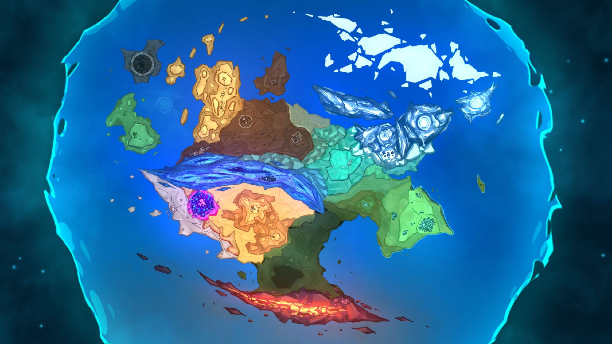
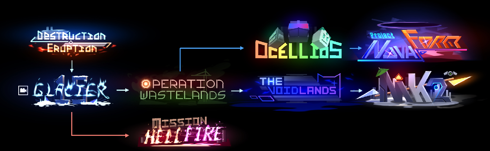

# The Dolpheverse Lore

**(AI was not used in any part of writing this lore)**  
****

**⭐THE DOLPHEVERSE ⭐**

<table>
  <tr>
    <td>📕Series Timeline and Summary Documents the mainline series of events that transpires after Ocellios Lab,  July 26, 109 IC. The storyline follows a self-inserted [PLAYER] escaping Ocellios Lab. 📁Cascade Classified Files A complete encyclopedia of every character, location, faction, technology, and other miscellaneous details. 📁Cascade Chronicles A documentation of lore artifacts, stories, and historical records from all over the series.</td>
  </tr>
</table>

<table>
  <tr>
    <td>📕<a href="https://docs.google.com/presentation/d/1O-p_AB1jbQi3y7Q-Axrke7MKcVPh7OYxu0zh5VDWyII/edit?usp=sharing">Series Timeline and Summary</a>&nbsp;&nbsp;📁<a href="https://docs.google.com/document/d/1MBbahr-3Dx8pwOEUQVnFxOSLz484TEa7mK--2mZ6Enc/edit?usp=sharing">Cascade Classified Files</a></td>
    <td>📁<a href="https://docs.google.com/document/d/1yqo21Yye6Yzym6DqlDesUhh-cJPCZtuHmaYdS3xi33U/edit?usp=sharing">Cascade Chronicles</a></td>
  </tr>
</table>

****  
⭐**Recommended Play Order⭐**  
🎥 \= There is a separate prologue associated with this level.

<table>
  <tr>
    <td>Destruction Eruption Glacier 15 🎥 Operation Wastelands Mission Hellfire</td>
    <td>The Voidlands Ocellios Project Novaform Mk2</td>
  </tr>
</table>

Notes:  
The Voidlands will be replaced in the future.  
Mission Hellfire has not been released yet.
